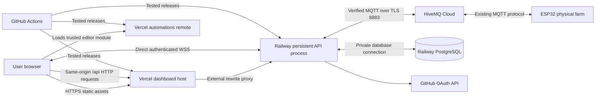

# SmartFarm Remote Web Application — Concrete Implementation Plan

**Prepared:** 17 September 2026  
**Status:** original implementation specification. The September 22 implementation, deployed release and requirement-by-requirement acceptance dispositions are recorded in [the final handoff](docs/FINAL_HANDOFF.md). Original gate/checklist wording below is retained; backup/restore and pump scope exceptions are not unqualified passes.
**Intended implementer:** an AI coding agent or human developer working in this repository.  
**Project directory:** `smartFarmRemoteWebApp/` (the existing Windows folder corresponding to the requested `smartfarmremotewebapp`).

**Navigation:** [Execution instructions](#0-read-this-first) · [Requirements](#1-requirements-and-acceptance-map) · [Repository evidence](#2-repository-investigation-and-compatibility-baseline) · [Architecture](#3-architecture-and-decisions) · [Accounts and credentials](#4-required-accounts-services-credentials-and-input-worksheet) · [Workspace and versions](#5-project-structure-tools-and-version-compatibility) · [Firmware protocol](#6-physical-farm-protocol-complete-specification) · [Database](#7-data-model-and-persistence) · [Backend lifecycle](#8-backend-service-and-single-controller-lifecycle) · [Auth and API](#9-authentication-browser-transport-and-api-contract) · [MQTT and commands](#10-mqtt-connection-freshness-and-command-execution) · [Automations](#11-automation-engine-specification) · [Frontend](#12-frontend-user-experience-and-component-design) · [Federation](#13-module-federation-concrete-boundary-and-deployment-contract) · [Local setup](#14-local-development-and-simulator) · [Tests](#15-test-strategy-and-exact-regression-matrix) · [CI/CD](#16-github-actions-cicd-and-release-coordination) · [Provisioning](#17-cloud-provisioning-checklist) · [Implementation phases](#18-step-by-step-implementation-work-packages) · [Runbooks](#19-operational-runbooks) · [Hardware acceptance](#20-supervised-physical-acceptance-procedure) · [Risks and gates](#21-risks-unresolved-assumptions-and-acceptance-gates) · [Handoff](#22-definition-of-done-and-ai-handoff) · [References](#23-primary-references-and-how-to-use-them).

## 0. Read this first

**User scope exception, 21 September 2026:** Defer backup/restore entirely,
including paid provider backups, schedules, manual backups, logical dumps and
local restore drills. This overrides backup/restore requirements below for the
current implementation scope (including P13 step 5 / G08 S12). Record the
exception explicitly; do not mark backup/restore as passed or reopen it without
a new user instruction.

**User credential exception, 21 September 2026:** Reuse the existing device MQTT
credential for the initial read-only connection without changing or resetting it.
Both live flags remain false. This overrides the dedicated-principal prerequisite
for that initial connection only; it does not establish broker-enforced read-only
permissions or qualify physical actuation. Current runtime evidence and remaining
work are recorded in `docs/IMPLEMENTATION_PROGRESS.md`.

Build a conventional, responsive web application with **React, TypeScript, Vite, and Fluent UI v9**. It must show every available farm reading, control the existing physical farm through HiveMQ, and manage the five existing automation categories. **Do not include the 3D model, Three.js, Electron, or an Android wrapper.**

The architecture is fixed as follows:

- **Vercel:** static frontend shell and a separately built Module Federation automation editor.
- **Railway:** a continuously running Node.js/TypeScript service containing the HTTP API, browser WebSocket server, persistent MQTT.js connection to HiveMQ, and authoritative automation engine.
- **Railway PostgreSQL:** authentication/session data, access permissions, settings, command/event records, and sampled history.
- **HiveMQ Cloud:** the existing MQTT broker used by the ESP32 farm.
- **GitHub:** source control, OAuth login, and GitHub Actions CI/CD.

**The MQTT client must never run in Vercel serverless functions.** Browser connections and frontend deployments must not determine the lifetime of the farm controller. Railway server sleeping must be disabled. The browser never receives MQTT credentials and never connects to HiveMQ directly.

This plan is grounded in the actual firmware and desktop implementation, including their current uncommitted changes. It intentionally distinguishes three things:

1. **Observed facts:** behavior present in the inspected source, or documented by the relevant vendor.
2. **Design decisions:** behavior this web application must implement.
3. **Acceptance gates:** behavior that must be demonstrated with actual builds, hosted services, browsers, and hardware before release.

No document can guarantee a particular cloud deployment, dependency combination, wireless connection, or physical pump will work before testing. The way to make this plan dependable is to make every consequential assumption explicit and require evidence at the gates below. Do not replace a failed gate with a claim that the architecture is “guaranteed.”

### 0.1 Instructions for the implementing AI

1. Read this entire document before changing code. Re-read the current firmware and repository instructions because they may have changed since this audit.
2. Inspect `git status` and preserve existing work. The repository was already dirty when this plan was prepared; those changes are not disposable scaffolding.
3. Implement inside `smartFarmRemoteWebApp/`. Changes to root-level GitHub workflows may be necessary later. Do not change the firmware, desktop app, Android app, credential files, or Git history as an incidental part of this project.
4. Create `docs/IMPLEMENTATION_PROGRESS.md`, recording completed task IDs, exact commands, results, unresolved issues, and the next task. Never write secrets into it.
5. Complete tasks in dependency order. A missing production secret blocks the production integration that needs it; it does not block local simulator development, tests, or UI implementation.
6. Use this document's endpoint names, settings, state semantics, and safety invariants consistently. If evidence requires a design change, record an ADR with the reason, affected contracts, and revised tests before proceeding.
7. Do not introduce a second automation engine in the browser. Do not import the desktop main process into the backend unchanged.
8. Never test an actuator against the real broker from CI, a preview deployment, or an unannounced local test. The physical acceptance phase is a deliberate, supervised activity.
9. Never infer physical success from an HTTP 202 response or MQTT publish callback. Preserve the confirmation distinctions in section 10.
10. After each phase, run its relevant checks and record evidence. Do not mark a phase complete because its files exist.
11. Do not commit secrets, invent missing credentials, weaken TLS validation to obtain a green test, or bypass failing tests with mocks at the boundary being tested.
12. Finish by supplying working local instructions, deployment instructions, operator runbooks, and a release checklist with actual results. A scaffold alone is not completion.

### 0.2 Release scope and explicit exclusions

Release 1 supports **one physical farm**, several authorized browser users, viewer/operator/admin roles, current firmware telemetry, manual controls, all five automations, history, and a simulator. It includes real Module Federation, unit tests, integration tests, browser end-to-end tests, and gated deployment workflows.

It does not include a 3D scene, AI chatbot, OCR, document processing, Tuya/Zigbee integration, custom firmware provisioning, public self-registration, email/password accounts, billing, offline command queues, or multi-farm MQTT routing. AWS Textract, Anthropic, and an additional identity provider are unnecessary for this scope.

## 1. Requirements and acceptance map

| ID | Requirement | Observable acceptance condition |
|---|---|---|
| R01 | React + TypeScript + Vite + Fluent UI v9 | Production builds use these technologies; forms and controls use v9 components; no v8 replacement or 3D dependency. |
| R02 | Frontend/backend separation | Browser calls the application API and its WebSocket endpoint; only Railway connects to HiveMQ. |
| R03 | Secrets remain server-side | No broker password, database URL, OAuth secret, deployment token, or session secret appears in frontend assets, source maps, browser responses, or logs. |
| R04 | All telemetry is available | All 22 current wire fields are represented through sensors, actuator state, diagnostics, and protection status; invalid readings are handled explicitly. |
| R05 | Manual farm controls | Fan, LED, buzzer, pump, feeder, LCD text/status, and LCD backlight work with truthful pending/result states and appropriate safety gates. |
| R06 | Five automations | Irrigation, low tank alarm, rain avoidance, cooling, and night lighting run on Railway with individual toggles and a master pause/resume. |
| R07 | Editable thresholds | Sliders and number fields share a validated draft; Apply persists once; telemetry never resets a user's draft. |
| R08 | Safe irrigation behavior | Low tank/unknown guard blocks starts; wet soil and rain stop automatic irrigation; pulses and cooldowns are bounded; no reconnect replay. |
| R09 | Access control | Anonymous users cannot inspect private farm data or control devices; viewers cannot mutate; all writes are authorized on the server. |
| R10 | Live updates | Authorized browser receives telemetry/status updates; stale and disconnected states are visible and disable starts. |
| R11 | History and audit | Time-bounded sensor history and paginated activity records are available; samples do not grow without retention limits. |
| R12 | Module Federation | Host loads the automation editor from a separately built/deployed remote with a tested contract and failure fallback. |
| R13 | CI/CD | Required checks gate deployment; PR workflows have no physical farm credentials; deployed artifacts are traceable to a commit. |
| R14 | Meaningful tests | Domain, protocol, database/API, real local MQTT, built federation, auth, and browser flows have appropriate tests. |
| R15 | Operational continuity | Closing the browser does not stop enabled server automations; backend restart or loss of fresh telemetry pauses them until explicit resume. |
| R16 | Practical usability | Keyboard operation, clear text labels, mobile layout, visible errors, and no dependence on color alone. |

## 2. Repository investigation and compatibility baseline

### 2.1 Evidence examined

The repository HEAD at investigation was `4e1e347` (16 September 2026), but important firmware protection and desktop automation work is present in the working tree beyond that commit. **Use the working tree as the investigation baseline; HEAD alone does not describe the current behavior.**

| Source, relative to repository root | What it establishes |
|---|---|
| `DEVELOPMENT.md` | Existing development setup and project history; contains sensitive connection material, so do not reproduce it wholesale. |
| `HiveMQ user info.txt` | Existing broker connection reference; tracked and sensitive; read locally only as needed. |
| `FanMqtt/FanMqtt.ino` | Actual sensor sampling, command handlers, LCD behavior, actuator behavior, Wi-Fi setup, and telemetry. |
| `FanMqtt/MqttLink.cpp` and `.h` | MQTT worker, reconnect behavior, packet/queue limits, TLS implementation. |
| `FanMqtt/PumpProtection.h` | Local tank hysteresis, pump authorization, and persistent protection settings. |
| `FanMqtt/README.md` and `tests/` | Operating notes and firmware policy tests. |
| `SmartFarmRemote3D/electron/protocol.cjs` | Existing telemetry validation, command encoding, and 4-second freshness policy. |
| `SmartFarmRemote3D/electron/command-link.cjs` | Publish handling, stop priority, bounded pump backup stop, and disconnect behavior. |
| `SmartFarmRemote3D/shared/automations.mjs` | Current automation defaults, thresholds, ownership, hysteresis, manual takeover, and cooldown logic. |
| `SmartFarmRemote3D/src/automation-panel.js` | Existing threshold editor behavior and fixes relevant to the new UI. |
| `SmartFarmRemote3D/tests/` | Regression scenarios to port rather than rediscover. |
| `android app/README.md` | Another potential direct MQTT controller that must be considered during cutover. |

The new folder was empty before this plan. No cloud accounts, private service settings, live broker permissions, hosted cookie behavior, or physical hardware were exercised during this document-only task.

### 2.2 Facts that materially affect the web architecture

- The firmware publishes to **`smartfarm/telemetry`**, nominally every **800 ms**. DHT sampling is approximately every **2 seconds**.
- It subscribes to **`smartfarm/cmd/#`** and a legacy fan command topic. The web application must use the canonical `smartfarm/cmd/<control>` topics only.
- Topics contain no farm identifier. Connecting a second identical farm to the same topic set would merge readings and broadcast commands. A database `farmId` cannot solve this.
- The firmware publishes numeric state flags, including pump, fan, buzzer, LED, feeder, and LCD backlight. It does not publish LCD text or a physical servo position measurement.
- It provides no command ID acknowledgement, boot ID, device timestamp, or sequence number. The web server can add its own receive sequence but cannot invent device-level delivery guarantees.
- A numeric buzzer command beeps for about **400 ms**, shorter than the telemetry interval. A valid beep can occur without any packet showing `buzz=1`.
- Firmware pump operation has a nominal **4-second software limit**. It checks water locally before starting and while running. These protections depend on the firmware loop continuing to execute.
- The current guard extension reports `guard`, `tankLow`, `tankRecover`, and `pumpBlocked`. All four are needed to establish compatibility with protected pumping.
- The firmware's rain flag uses `steam >= 800`. This is a firmware threshold, not a remotely configurable setting in the current command protocol.
- Firmware MQTT disconnect handling calls `allOff()` after detecting loss of its broker connection. A backend-to-broker outage alone does not necessarily disconnect the firmware; do not assume the farm instantly switches everything off when Railway loses MQTT.
- Firmware TLS currently uses `setInsecure()`. That is an existing certificate-verification limitation. The new backend must verify HiveMQ's certificate; this does not retroactively fix the firmware.
- The existing Wi-Fi setup AP is `TT-SmartFarm`. Its local setup credentials are unrelated to the web application login and HiveMQ authentication. Do not change provisioning for this project.

### 2.3 Known physical issue that must remain visible

The user previously reported the battery-powered farm freezing during pump automation, losing connectivity, and displaying corrupted LCD text. Updated firmware had been uploaded. This investigation does not establish the root cause or prove it resolved.

Consequently, live pump enablement must remain off until the supervised acceptance procedure in section 20 passes. Initial production can offer read-only telemetry and separately verified non-pump controls while irrigation remains disabled. A cloud UI cannot guarantee a physical cutoff if the MCU, its power supply, or the wiring fails.

### 2.4 Existing credential exposure

`HiveMQ user info.txt`, `DEVELOPMENT.md`, and firmware source are tracked and contain connection secrets. Do not copy their values into this plan, the web repository, fixtures, or screenshots.

Before publishing source, choose a clean repository export or an explicitly coordinated sanitization process. Adding `.gitignore` does not untrack files or erase Git history. Create a dedicated backend MQTT credential. Coordinate any rotation of the device's existing credential with the farm's configuration/firmware deployment; revoking it without a cutover would disconnect the farm. Treat history cleanup as a separate deliberate task, never an automatic reset or force push.

## 3. Architecture and decisions

### 3.1 Deployment topology



The HTTP rewrite is routing, not a Vercel MQTT process. The browser WebSocket terminates directly at Railway. No long-lived telemetry stream passes through a Vercel function.

### 3.2 Architectural decision records to create

| ADR | Decision | Reason and tradeoff |
|---|---|---|
| 001 | Persistent Railway service owns MQTT and automations | Controller lifetime must outlive browser requests. One process is sufficient for one farm; safe handover is still required. |
| 002 | Vercel static React host + automation remote | Satisfies frontend and federation requirements while keeping the remote boundary small. Adds asset/version coordination that must be tested. |
| 003 | Same-origin HTTP proxy + ticket-authenticated direct WSS | Keeps browser sessions first-party and avoids relying on third-party cookies for the Railway domain. Adds a small ticket protocol. |
| 004 | PostgreSQL, opaque sessions, GitHub OAuth | Uses existing accounts, avoids managing user passwords, and provides durable authorization/settings/history. |
| 005 | MQTT QoS 0, clean session, no retain, no offline queue for commands | Matches existing firmware behavior and avoids delayed or replayed actuator starts. Delivery remains best effort. |
| 006 | Commands are HTTP; sockets carry updates only | Centralizes authorization, idempotency, validation, and auditing without maintaining two command paths. |
| 007 | One controller with database advisory lock | Handles process overlap during deploy/restart. Not a substitute for device-level fencing or topic isolation. |
| 008 | Explicit automation resume after restart/disconnect | Avoids surprise irrigation after outages; closing a browser alone does not pause a healthy backend. |
| 009 | Current firmware contract preserved | Avoids coupling web delivery to a firmware rewrite. Exposes limitations honestly and reserves protocol improvements for later. |
| 010 | Simulator is the default non-production target | Makes tests, previews, and demonstrations usable without exposing hardware credentials. |

Redis, Kafka, Kubernetes, RabbitMQ, a second production broker, and an external realtime provider are not required. PostgreSQL and a single Railway service are enough for this release. Do not introduce extra infrastructure merely to demonstrate more technologies.

### 3.3 Availability and failure model

There is one authoritative farm controller per environment. The browser can disconnect independently. PostgreSQL can fail independently. Railway can restart. HiveMQ can disconnect while the device remains connected. The farm can stop publishing while the broker remains reachable. Represent these as separate states.

Automatic decisions require all of: controller ownership, database availability, MQTT subscription readiness, fresh valid telemetry, master enabled, rule enabled, no relevant manual override/fault, and the rule's own conditions. Pump starts additionally require live-pump enablement and confirmed firmware protection.

On loss of these prerequisites, prevent new starts. While still holding valid controller ownership and a usable MQTT connection, attempt bounded stop/cleanup of outputs owned by this process. Do not queue cleanup for replay after reconnect. If ownership is lost, cease publishing entirely; the new owner handles recovery after its own gates.

A network architecture is not a hardware safety controller. Retain the firmware protections and supervised physical testing.

### 3.4 Hosting facts verified in vendor documentation

Vercel supports external rewrites suitable for proxying `/api`. The actual cookie/header behavior of the chosen deployment must still pass the early cloud proof. [Vercel rewrites](https://vercel.com/docs/routing/rewrites)

Railway supports public secure WebSockets. Configure an ordinary persistent service and disable sleeping; do not deploy the controller as a scheduled job or request-scoped function. [Railway networking](https://docs.railway.com/networking/public-networking/specs-and-limits), [Railway sleeping behavior](https://docs.railway.com/deployments/serverless)

Railway deploys can briefly overlap old and new processes. Configure a shutdown grace period and implement controller ownership; replica count one alone is insufficient. Its deployment health check must not wait for the farm-controller lock. [Railway deployment lifecycle](https://docs.railway.com/deployments/reference), [Railway health checks](https://docs.railway.com/deployments/healthchecks)

## 4. Required accounts, services, credentials, and input worksheet

**You do not need to prepare a complete cloud deployment before the AI can build the application. Use one short file, not a form for every service.**

### 4.1 What you provide now

Open `smartFarmRemoteWebApp/private-setup/smartfarm_setup.txt`. It has just four lines:

```text
GITHUB_USERNAME=
HIVEMQ_HOST=
HIVEMQ_USERNAME=
HIVEMQ_PASSWORD=
```

| Entry | What to enter |
|---|---|
| `GITHUB_USERNAME` | The GitHub username you want to use to sign into SmartFarm. The AI looks up the numeric ID. |
| `HIVEMQ_HOST` | The farm's broker hostname, without `mqtts://` or a port. |
| `HIVEMQ_USERNAME` | The MQTT client username, not your HiveMQ website login. |
| `HIVEMQ_PASSWORD` | The corresponding MQTT client password. |

**Existing information should be reused.** This repository already contains `HiveMQ user info.txt`. You may leave the three HiveMQ lines blank when that file has the correct details; the AI should read the relevant values locally and ask only if something is missing. The existing device credential must not be reset. A dedicated backend credential can be created during live deployment setup, without making you inventory the whole broker account beforehand.

Fictional example of a filled file:

```text
GITHUB_USERNAME=example-farm-owner
HIVEMQ_HOST=example-cluster.s1.eu.hivemq.cloud
HIVEMQ_USERNAME=smartfarm-web
HIVEMQ_PASSWORD=EXAMPLE_ONLY_REPLACE_WITH_YOUR_MQTT_PASSWORD
```

Replace example values with your own; leave unknown values blank. No section headers, status fields, dates, API endpoint inventory, or separate staging/production forms are needed. The file is Git-ignored. Personal account passwords and MFA codes are never required.

Local simulator development can start even if this file is incomplete.

### 4.2 Where to find those values

**GitHub:** open [your GitHub account](https://github.com/), then your profile. Use the username in the profile URL. That is the only GitHub value to prepare now.

**HiveMQ:** reuse the local broker information if current. Otherwise:

1. Sign in to the [HiveMQ console](https://console.hivemq.cloud/) and open the existing farm cluster.
2. Copy its broker hostname from the connection details.
3. In Access Management, use or create the intended backend MQTT username/password. Do not replace the physical device's working credential.

The AI handles the normal TLS port (`8883`, checked against existing configuration), topic names, permissions verification, and derived URLs. The browser does not need HiveMQ's WebSocket endpoint. [HiveMQ connection guide](https://docs.hivemq.com/hivemq-cloud/quick-start-guide.html), [credential creation](https://docs.hivemq.com/hivemq-platform/connect/create-access-credentials.html)

If you already chose a different GitHub repository, tell the AI its URL. Otherwise it inspects the current repository and handles the repository setup during implementation.

### 4.3 What happens later — no preparation form needed

These requirements still exist, but they become relevant when the AI reaches deployment/login integration:

| Stage | What you may need to do | What the AI handles |
|---|---|---|
| Deploy to Railway | Sign in/authorize access, or provide a deployment token if the chosen tool needs one. | Backend/database setup, service IDs, database connection, public API URL, and runtime settings. |
| Deploy to Vercel | Sign in/authorize access, or provide a deployment token if required. | Frontend projects, project/team IDs, build settings, URLs, and remote module configuration. |
| Enable Sign in with GitHub | Register the OAuth app when the dashboard URL is known, if the available tools cannot do it. The AI gives you the exact values to enter. | Callback URL, identity lookup, sessions, permissions, and configuration. Only the generated client ID and client secret need transferring. |
| Connect production HiveMQ | Create a dedicated backend credential if the existing one is shared with the farm and needs separating. | Reuse the known cluster details, verify actual permissions, configure Railway, and test read-only first. |
| Add GitHub Actions deployment | Authorize the required deployment access, if it is not already configured. | Workflows, environment mapping, project IDs, and secret placement. |

For the OAuth step, use [GitHub OAuth app settings](https://github.com/settings/developers). The AI supplies the application homepage and exact callback URL before asking for the client ID/secret. For tokens, use the appropriate [Railway project-token settings described here](https://docs.railway.com/integrations/api) or [Vercel token page](https://vercel.com/account/tokens) only when needed. You do not need to create every possible token in advance.

Generated cookie secrets, farm UUIDs, database passwords, project IDs, ports, callback URLs, and staging configuration are implementation work. The AI should create, discover, derive, or configure them through authorized tools; if a provider requires your interaction, give you that single concrete step at the time. It must not present those generated values as homework before coding starts.

No AWS, Textract, Anthropic, S3, or extra service-provider account is required for this application.

**Your handoff can simply be:** “My details are in `private-setup/smartfarm_setup.txt`. Reuse existing project information and start with the simulator.”

### 4.4 AI reference — runtime configuration, not a user form

The following reference preserves the exact implementation variables used by the rest of the plan. **Do not ask the user to fill this table.** Resolve values from the short setup file, existing repository/provider configuration, or implementation-generated values. Ask only for genuinely missing authorization or a provider-generated secret that cannot otherwise be supplied.

<details>
<summary>Expand the environment-variable reference for the implementing AI</summary>

Create `.env.example` files with placeholders. Validate runtime configuration on startup. Reject incomplete or contradictory production settings.

**Railway API runtime:**

| Variable | Example/meaning | Secret? |
|---|---|---|
| `NODE_ENV` | `production` | No |
| `APP_ENV` | `local`, `staging`, or `production` | No |
| `PORT` | Assigned by Railway; listen on `0.0.0.0` | No |
| `PUBLIC_APP_ORIGIN` | `https://<dashboard>.vercel.app` | No |
| `PUBLIC_API_ORIGIN` | `https://<api>.up.railway.app` | No |
| `ALLOWED_BROWSER_ORIGINS` | Exact comma-separated host origins; no wildcard | No |
| `DATABASE_URL` | Private Postgres connection string | **Yes** |
| `GITHUB_OAUTH_CLIENT_ID` | Environment's OAuth app ID | Identifier |
| `GITHUB_OAUTH_CLIENT_SECRET` | OAuth app secret | **Yes** |
| `GITHUB_OAUTH_CALLBACK_URL` | `https://<dashboard>/api/auth/github/callback` | No |
| `AUTH_COOKIE_SECRET` | Cryptographically random value, at least 32 bytes | **Yes** |
| `BOOTSTRAP_ADMIN_GITHUB_ID` | Stable GitHub numeric ID represented as a string | No |
| `FARM_ID` | Stable UUID seeded in DB | No |
| `FARM_NAME` | `TT SmartFarm` | No |
| `FARM_MODE` | `simulator` or `live` | No |
| `SIMULATOR_TRANSPORT` | `memory` for hosted staging; `mqtt` for local MQTT integration; simulator mode only | No |
| `SIMULATOR_MQTT_URL` | `mqtt://127.0.0.1:1883`; local/test broker only, required for simulator MQTT transport | Local identifier |
| `LIVE_COMMANDS_ENABLED` | Default `false`; explicit production cutover switch | No |
| `LIVE_PUMP_ENABLED` | Default `false`; requires hardware acceptance | No |
| `HIVEMQ_HOST` | Bare cluster hostname; required only for live adapter | Identifier |
| `HIVEMQ_MQTT_TLS_PORT` | `8883` | No |
| `HIVEMQ_USERNAME` | Dedicated backend MQTT principal | Sensitive |
| `HIVEMQ_PASSWORD` | Backend principal's password | **Yes** |
| `MQTT_CLIENT_ID_PREFIX` | e.g. `smartfarm-web-prod`; append unique instance ID | No |
| `MQTT_TOPIC_TELEMETRY` | `smartfarm/telemetry` in live mode | No |
| `MQTT_TOPIC_COMMAND_PREFIX` | `smartfarm/cmd/` in live mode | No |
| `LOG_LEVEL` | `info`; redact secrets even at debug level | No |
| `TELEMETRY_RETENTION_DAYS` | `30` | No |
| `EVENT_RETENTION_DAYS` | `90` | No |
| `COMMAND_RETENTION_DAYS` | `30` | No |
| `RAILWAY_DEPLOYMENT_DRAINING_SECONDS` | Initial value `15`, verified in deployment test | No |

Do not accept arbitrary broker/topic changes from browser settings. Keep live values server-controlled. A production process with `FARM_MODE=simulator` must show an unmistakable simulation label; mode is included in all snapshots.

In **live mode**, `LIVE_COMMANDS_ENABLED=false` means strictly no MQTT command publishes, including guard synchronization and cleanup. It is a true read-only connection. Enable it deliberately before supervised controls; changing it is a deployment/configuration operation, not a browser toggle. `LIVE_PUMP_ENABLED=false` blocks pump starts but still permits pump Stop/All off when general live commands are enabled. Both flags are checked at the final publish boundary. Simulator mode never connects to the production broker and does not require these live flags to exercise simulated controls.

**Vercel host build-time public configuration:**

| Variable | Meaning |
|---|---|
| `VITE_APP_ENV` | Visible environment label. |
| `VITE_API_BASE` | `/api`; same-origin HTTP. |
| `VITE_REALTIME_URL` | `wss://<api>.up.railway.app/ws`; no tokens or passwords. |
| `VITE_AUTOMATIONS_REMOTE_URL` | Approved immutable deployment URL to the actual remote entry artifact. |
| `VITE_RELEASE_SHA` | Source commit ID for diagnostics. |

The remote needs its own public asset base/release metadata but no MQTT, OAuth, database, or deployment credentials. Every `VITE_*` value is public bundle content. [Vite environment variables](https://vite.dev/guide/env-and-mode)

**GitHub Actions deployment configuration:** `VERCEL_TOKEN` and `RAILWAY_TOKEN` are secrets. `VERCEL_ORG_ID`, separate `VERCEL_HOST_PROJECT_ID`/`VERCEL_REMOTE_PROJECT_ID`, Railway project/environment/service IDs, and public deployment origins are variables. Use separate values per protected environment. Ordinary PR CI receives none of the production runtime secrets.

</details>

### 4.5 Handling the short setup file

- Read it as literal `KEY=value` data, splitting only at the first `=`. Never execute it as a shell script or print its secret values.
- Keep it in the ignored `private-setup/` folder. The existing web-root Docker/Vercel exclusions continue to apply.
- Reuse existing values before asking the user to supply them again. A blank field means “not supplied here,” not “invent a value.”
- Continue local simulator implementation while hosted access is unavailable. Use the relevant later integration gate to identify any real blocker.
- Use `credential-templates/smartfarm_setup.example.txt` as the blank preparation template.
- Supplying credentials does not start a deployment or operate the physical farm. Keep the plan's initial live-command and pump restrictions.

## 5. Project structure, tools, and version compatibility

### 5.1 Proposed workspace layout

Use npm workspaces with one lockfile. Keep the new application self-contained:

```text
smartFarmRemoteWebApp/
  IMPLEMENTATION_PLAN.md
  README.md
  package.json
  package-lock.json
  .node-version
  .npmrc
  .gitignore
  .dockerignore
  tsconfig.base.json
  eslint.config.js
  compose.yaml
  apps/
    dashboard/
      src/{app,auth,components,features,lib,test}/
      vite.config.ts
      vercel.json
      .env.example
    automations-remote/
      src/{AutomationPanel,contract,standalone,test}/
      vite.config.ts
      vercel.json
      .env.example
    api/
      src/
        {config,db,auth,http,realtime,mqtt,controller,services,observability}/
        app.ts
        main.ts
      migrations/
      Dockerfile
      railway.toml
      .env.example
  packages/
    contracts/src/       # Runtime schemas + DTO types, no Node secrets/imports
    domain/src/          # Pure protocol/automation/threshold rules
    ui/src/              # Small shared Fluent theme and presentational components
    test-support/src/    # Fixtures, fake clocks, simulator scenarios
  tools/
    simulator/
    broker/
    scripts/
  tests/
    integration/
    e2e/
    federation/
  docs/
    adr/
    IMPLEMENTATION_PROGRESS.md
    DEPENDENCY_BASELINE.md
    LOCAL_DEVELOPMENT.md
    DEPLOYMENT.md
    HARDWARE_ACCEPTANCE.md
    OPERATIONS.md
    SECURITY.md
```

If this remains part of the current Git repository, workflows belong in **repository-root** `.github/workflows/`, with `working-directory: smartFarmRemoteWebApp` and correct path filters. A nested `.github/workflows` is not discovered by GitHub. If a new sanitized repository is created later, the web folder becomes its root and workflow paths must be adjusted deliberately. Do not create an accidental nested `.git` directory.

Exclude `.env`, `.env.*.local`, `.vercel`, node_modules, build output, coverage, test reports, database volumes, and local secrets. Allow checked-in `.env.example` files containing placeholders only. Docker build context must exclude the parent firmware/credential files.

### 5.2 Technology choices

| Concern | Choice |
|---|---|
| Frontend | React + React DOM, TypeScript strict mode, Vite, `@vitejs/plugin-react`. |
| Components | `@fluentui/react-components` v9 and compatible Fluent icons; `FluentProvider`. |
| Federation | Official `@module-federation/vite` plugin in both builds. |
| Routing/data | React Router; TanStack Query for HTTP cache/mutations; one host-managed realtime store. |
| Backend | Node.js 24 LTS line as initial candidate; Fastify with compatible cookie, websocket, rate-limit, and security-header plugins. |
| Validation | Zod schemas in contracts; explicit parsing at boundaries; inferred TypeScript types. |
| MQTT | MQTT.js on Node only. |
| Database | PostgreSQL + `pg`, explicit SQL repositories and versioned migrations, `node-pg-migrate` or equivalent pinned migration runner. |
| Tests | Vitest, React Testing Library, Playwright, real disposable PostgreSQL and Mosquitto for integration. |
| Logging | Fastify/Pino structured logs with explicit redaction. |
| Charts | Small SVG-based history chart implemented in React, with an equivalent accessible data table; no extra chart provider needed. |

Fluent UI v9 is the React component library, not Fluent Web Components or a v8 package. [Microsoft Fluent development guidance](https://fluent2.microsoft.design/get-started/develop)

### 5.3 Mandatory compatibility proof before full implementation

The local machine had Node `24.21.0` and npm `11.19.0` during investigation. That is an observation, not proof of every dependency's compatibility. Do not hardcode guessed future package versions or install everything using unreviewed `latest` ranges.

Perform P01 below:

1. Inspect current package engines and peer dependencies using `npm view` for React, Fluent v9, Vite, federation plugin, Fastify, and test tools.
2. Select a mutually compatible stable set, preferring React 19 if all selected packages support it; use a supported React 18 combination if the proof requires it and record why. Keep the requested React/TypeScript/Vite/Fluent v9 architecture.
3. Pin exact direct dependency versions, Node patch, npm version, CI action revisions, and container image versions/digests. Commit the lockfile; use `npm ci` thereafter.
4. Build a minimal host and remote in production mode, expose a Fluent panel with a hook, render it in the host's theme, and test a button and dialog. This catches duplicate React, JSX runtime, context, CSS, and chunk path failures.
5. Test separate origins/ports and hosted static assets, not only a shared dev server.
6. Record package versions, build options, artifact paths, browser results, and relevant peer warnings in `DEPENDENCY_BASELINE.md`.
7. Resolve peer mismatches; do not normalize `--force` or `--legacy-peer-deps` as the solution.

The official Vite federation integration documents build configuration and feature limitations. Its existence is not proof that every Vite/React/plugin version combination or development-mode behavior works. [Vite federation integration](https://module-federation.io/integrations/build-tool/vite), [official plugin repository](https://github.com/module-federation/vite)

## 6. Physical farm protocol: complete specification

### 6.1 Telemetry field inventory

Validate MQTT input before it reaches any automation or UI. Wire flags are numbers `0`/`1`; normalize them to booleans in application DTOs while retaining the original validated values in diagnostic records. Never use JavaScript truthiness to accept arbitrary values.

| Wire field | Meaning | Validation/display behavior | UI location |
|---|---|---|---|
| `t` | DHT11 temperature, °C | When `dht=1`, finite and within existing parser range -40..125; when failed, show unavailable rather than `-99 °C`. | Climate card/history. |
| `h` | DHT11 relative humidity, % | When healthy, finite 0..100; failed `-1` is unavailable. | Climate card/history. |
| `dht` | DHT health | Exactly 0 or 1; does not mean the whole farm is offline. | Climate health and diagnostics. |
| `soil` | Approximate soil moisture, % | Finite 0..100; explain kit-calibrated estimate. | Soil card/history/irrigation. |
| `water` | Approximate tank level, % | Finite 0..100; not liters. | Tank card/history/protection. |
| `light` | Roof photoresistor raw ADC | Finite 0..4095, lower is darker. Show raw reading and optional qualitative label. | Light card/history/night light. |
| `steam` | Rain/steam plate raw ADC | Finite 0..4095; do not label as millimeters of rain. | Weather card/history/diagnostics. |
| `rain` | Firmware rain classification | Exactly 0 or 1; currently derived at raw 800. | Weather card/rain protection. |
| `dist` | Ultrasonic distance, cm | Finite -1..1000; `-1` means no echo, displayed unavailable. | Distance card/history. |
| `pir` | PIR motion detected | Exactly 0 or 1. | Motion card and event history. |
| `btn` | Yellow button pressed | Exactly 0 or 1. | Button indicator/events. |
| `rssi` | Wi-Fi received signal strength, dBm | Finite -150..0; display numeric plus descriptive strength. | Connection card/history. |
| `fan` | Reported fan state | Exactly 0 or 1. | Fan control. |
| `led` | Reported white LED state | Exactly 0 or 1. | LED control. |
| `feed` | Reported feeder command state | Exactly 0 or 1; label Open/Closed, not measured servo angle. | Feeder control. |
| `pump` | Reported pump state | Exactly 0 or 1. | Pump control/status. |
| `buzz` | Reported buzzer state | Exactly 0 or 1; does not capture every short beep. | Buzzer control/status. |
| `bl` | Reported LCD backlight state | Exactly 0 or 1. | LCD backlight control. |
| `guard` | Firmware pump protection capability | If extension present, must equal 1. | Protection diagnostics. |
| `tankLow` | Firmware-applied low tank threshold | Integer 1..90. | Tank protection settings/status. |
| `tankRecover` | Firmware-applied recovery threshold | Integer greater than `tankLow`, at most 100. | Tank protection settings/status. |
| `pumpBlocked` | Firmware pump block reason | Integer 0=ready, 1=low tank, 2=no valid water sample. | Pump explanation/diagnostics. |

The original 18 fields are required for a valid packet. The four guard fields must either all be absent (legacy capability) or all be present and valid. A partial/malformed extension rejects the packet. Additional unknown keys may be ignored with a diagnostic metric; they must not silently become trusted actuator inputs.

Enforce a 4,096-byte inbound telemetry limit before JSON parsing, require a plain object, reject NaN/non-finite/wrong types, and never merge incomplete packets with prior values to manufacture a fresh complete sample. Store invalid-message counts with rate-limited diagnostics, not uncontrolled raw payload logging.

The kit's solar panel has **no telemetry field** in the current firmware. Do not fabricate panel voltage, battery percentage, power consumption, pH, CO2, or other measurements. LCD text is an intended setting maintained by the application, not a sensor reading.

Soil and water percentages originate from scaled/clipped ADC readings: roughly `floor(raw / 4095 * 100 * 2.3)` for soil and `* 2.5` for water. They require practical calibration; sliders do not turn these readings into laboratory measurements.

### 6.2 Command mapping

The HTTP API accepts typed actions, not arbitrary topic/payload strings. Only the backend translates them into these MQTT commands. All commands use **QoS 0 and retain=false**.

| API action | MQTT topic suffix after `smartfarm/cmd/` | Payload | Outcome semantics |
|---|---|---|---|
| `fan.set` | `fan` | `on` / `off` | A newer packet can show matching `fan`. |
| `light.set` | `led` | `on` / `off` | A newer packet can show matching `led`. |
| `pump.pulse` | `pump` | `pulse` | Bounded pulse; report sent/observed/ended separately. |
| `pump.stop` | `pump` | `off` | Newer `pump=0` shows reported stopped. |
| `buzzer.beep` | `buzzer` | Integer frequency string, 40..10000 Hz | Numeric command triggers about 400 ms beep; publish result is not audible confirmation. |
| `buzzer.stop` | `buzzer` | `off` | Newer `buzz=0` shows reported off. |
| `feeder.set` | `feeder` | `open` / `close` | Newer `feed` shows commanded logical state only. |
| `lcd.setText` | `lcd` | `line1\|line2` on the wire without the escape backslash | Sent only; firmware does not echo text. |
| `lcd.showStatus` | `lcd` | `status` | Requests normal firmware sensor display; sent only. |
| `lcd.setBacklight` | `backlight` | `on` / `off` | Newer `bl` shows matching state. |
| `farm.allOff` | `all` | `off` | Stops fan/LED/pump/buzzer and closes feeder; **does not change LCD text/backlight**. |
| Internal guard application | `pumpguard` | `low,recover`, e.g. `20,30` | Requires newer telemetry echoing both thresholds before confirmed. |

Continuous buzzer `on` and pump `on` exist in firmware. Release 1 deliberately exposes a short beep and a bounded pump pulse, not a continuous pump switch. Do not add a pump-duration slider: current firmware does not support a duration payload. A later firmware extension would need a separate protocol revision.

LCD validation: two strings, each 0..16 characters, printable ASCII U+0020..U+007E excluding `|`. Reject embedded newlines and unsupported characters with an actionable message. Encode exactly one separator. Firmware may trim trailing whitespace; a UI preview cannot prove the physical LCD text. An empty pair is allowed if the user intends to clear custom text.

### 6.3 A representative fixture

Use synthetic values, never captured credentials:

```json
{
  "t": 24, "h": 45, "dht": 1,
  "soil": 38, "water": 65, "light": 2559,
  "steam": 300, "rain": 0, "dist": 12.4,
  "pir": 0, "btn": 0, "rssi": -57,
  "fan": 0, "led": 0, "feed": 0,
  "pump": 0, "buzz": 0, "bl": 1,
  "guard": 1, "tankLow": 20, "tankRecover": 30, "pumpBlocked": 0
}
```

### 6.4 Protocol limitations to display accurately

“Reported on” means the firmware reported its logical output state. It does not prove the fan is spinning, water is flowing, or the feeder physically moved. “State matches” does not uniquely identify the command responsible; another MQTT controller could have produced it. “Sent” means a bounded backend publish attempt completed without an immediate local error, not a hardware acknowledgement.

Retained commands are particularly problematic because the current firmware does not reject them using the retained flag. Never publish retained commands. Before cutover, inspect the known command topics with an authorized diagnostic tool. Clear a known retained command only during a deliberate supervised cleanup, recording exactly which topic was cleared. Do not wildcard-delete broker data or use physical command topics for connection tests.

## 7. Data model and persistence

### 7.1 Schema conventions

Use UUID primary keys for application entities, UTC `timestamptz` for persisted times, database constraints for critical invariants, parameterized SQL, and explicit transactions. GitHub's user ID is a decimal string identifier; do not use a mutable username for authorization. Use monotonic process time for live durations and receive-age calculations, never wall-clock subtraction alone.

Keep database access behind repositories. Zod validation does not replace SQL constraints. Migrations run as a dedicated deployment step under a migration lock, not simultaneously from every app instance.

| Table | Required fields and constraints | Purpose/indexes |
|---|---|---|
| `users` | UUID, unique `github_id`, username/display name, created/last-login times, disabled time | Identity; no GitHub password or long-lived OAuth token needed. |
| `farms` | UUID, name, environment, stable unique controller lock key, created time | One seeded farm; lock key cannot collide with another farm. |
| `farm_memberships` | `(farm_id,user_id)` unique, role enum viewer/operator/admin | Authorization; at least one active admin protected in service transaction. |
| `login_allowlist` | Unique GitHub ID, intended initial role/farm, created-by/time, revoked time | Explicit invitation without public registration. |
| `sessions` | UUID, unique SHA-256 token hash, user ID, CSRF secret/hash material, created/expires/last-seen/revoked times | Opaque sessions; index hash and expiry. |
| `oauth_flows` | Hashed state, browser binding hash, PKCE verifier, environment, expiry, consumed time | Short-lived server-side login state; delete promptly. Verifier is sensitive. |
| `ws_tickets` | Hashed random ticket, session ID, allowed farm ID, origin, expiry, consumed time | Atomic single-use redemption; indexed expiry. |
| `automation_configs` | Farm PK, integer revision, validated versioned settings JSONB, editor, updated time | Durable requested settings, optimistic concurrency. |
| `automation_runtime` | Farm PK, paused reason, manual overrides, attempts, last pump-stop timestamp, cooldown-until timestamp, guard target/application status, runtime revision | Conservative recovery state; process start always pauses master. |
| `farm_preferences` | Farm PK, last requested LCD lines/mode, changed-by/time | Intended LCD text; not reported hardware state. |
| `commands` | UUID, farm/actor/source, idempotency key, normalized request hash, action/payload, connection epoch, receive-sequence baseline, status, timestamps, reason, superseded-by | Unique `(farm_id,actor_scope,idempotency_key)`; index farm/time and pending status. |
| `events` | UUID, farm, server sequence/epoch metadata, category/severity, actor, command ID, safe structured details, created time | Indexed `(farm_id,created_at,id)` for cursor pagination. |
| `telemetry_samples` | Farm/time PK or unique pair; normalized measurements and validity flags; reported actuator/guard data | Indexed farm/time; sampled history only. |
| `schema_migrations` | Migration version and checksum | Migration runner's managed table. |

Session token hashes prevent a database-only session table read from immediately yielding usable bearer tokens. Encrypting the whole database is a platform concern; do not log transient PKCE verifiers or WebSocket tickets. Delete expired OAuth flows and tickets at least every minute.

`actor_scope` is a required non-null string, such as `user:<uuid>` or `automation:<farm-uuid>`, so PostgreSQL NULL uniqueness behavior cannot admit duplicate automated intents. Use a stable generated intent UUID for each automatic decision as well as each manual request.

### 7.2 Storage and retention policy

- Stream every accepted packet to the current state store; coalesce browser sends only under backpressure.
- Write at most **one history sample per 10 seconds per farm**. At continuous operation this is 8,640 rows/day, about 259,200 rows in 30 days. These are planning estimates; measure actual row/index size.
- Preserve rain/motion/button/actuator/protection transitions as events so 10-second sampling does not erase short occurrences that were actually observed. A beep never seen in telemetry remains a command event, not an invented sensor event.
- Keep raw sampled history for **30 days**, event/audit history for **90 days**, and command/idempotency records for **30 days** initially.
- An idempotency key is a new random UUID per user intent. Reuse after record expiry is unsupported; clients never recycle keys.
- Delete old rows in bounded batches once per day. Deduplicate noisy reconnect/error events and cap diagnostic payload lengths.
- History endpoint supports at most a 30-day request window and at most 2,000 points per selected series. Aggregate into requested buckets with min/max/average/count, preserving gaps and invalid DHT/no-echo values as missing data.
- Do not interpolate missing water levels into control decisions. Historical samples are never a source of “fresh” automation input.

### 7.3 Settings and runtime consistency

Settings updates use a revision and `If-Match`. In one transaction: lock configuration row, compare revision, validate the entire proposed configuration, persist the new revision, record the editor/event, and mark affected guard synchronization pending. Return 409 on a stale revision with the current server version; never silently overwrite another user's edit.

Persist manual takeover and pump attempt/cooldown decisions before issuing a start. This prevents a crash from erasing a pulse attempt. It can conservatively count an attempt whose publish never happened; that is preferable to an unbounded extra pulse after recovery. Explain this in the reset UI.

The master may be marked active in the running process, but **every new process/controller ownership epoch starts paused**, irrespective of a previously stored enabled flag. Persist the reason so the UI can say “Paused after backend restart.” Loading historical state cannot resume automation.

### 7.4 Backup and recovery

Provision daily backups with an initial seven-day retention target where the selected Railway plan supports it. Record the actual facility and retention configured. Perform a restore into an isolated database before release and periodically thereafter. A restored database must start with live commands disabled and automations paused.

Railway's standard PostgreSQL service requires the operator to handle database maintenance and recovery. A provisioned database is not evidence that backups exist. [Railway PostgreSQL](https://docs.railway.com/databases/postgresql), [backup and restore guidance](https://docs.railway.com/guides/postgres-backups-restores)

## 8. Backend service and single-controller lifecycle

### 8.1 Module responsibilities

| Module | Responsibility | Must not do |
|---|---|---|
| `config` | Parse env, validate origins/mode/credentials, expose redacted config summary | Return secrets to API routes. |
| `auth` | OAuth, sessions, CSRF, roles, revocation | Trust frontend role claims. |
| `mqtt` | One live adapter, validation, connection epochs, bounded publishing | Run rules or queue offline actuator starts. |
| `controller` | Ownership, freshness, command ordering, automation runner, lifecycle | Depend on a browser connection. |
| `services` | Commands/configuration/history/access operations with transactions | Publish raw browser-provided MQTT strings. |
| `http` | Routing, validation, response mapping, request IDs | Duplicate business decisions in route handlers. |
| `realtime` | Ticket authentication, authorized snapshots/events, backpressure | Accept actuator commands over WebSocket. |
| `db` | Migrations, repositories, dedicated advisory-lock connection | Return lock connection to a generic pool while lock held. |
| `observability` | Redacted logs, bounded metrics, health endpoints | Treat an offline farm as a dead HTTP process. |

Construct the Fastify app separately from `listen()` so integration tests can inject requests. Inject clock, MQTT adapter, database repositories, and ID generator where useful. Avoid dependency injection frameworks unless there is an actual need.

### 8.2 Ownership and deployment overlap

Use a **session-level PostgreSQL advisory lock** for the farm's stable lock key, held on one dedicated database connection. Only the process holding that lock may run its live MQTT controller or publish commands. The HTTP app can start before ownership is acquired.

PostgreSQL advisory locks last according to the connection/transaction form chosen; use the session form intentionally and release it on shutdown. [PostgreSQL locking documentation](https://www.postgresql.org/docs/current/explicit-locking.html)

Startup order:

1. Parse configuration and initialize logging.
2. Connect the normal DB pool; verify compatible schema, without automatically running contested migrations.
3. Initialize HTTP/auth/history services and start listening.
4. Report HTTP readiness if DB/schema/auth configuration is usable. **Do not require farm online or advisory-lock ownership for deployment health.**
5. Try to acquire the dedicated farm lock. If another process holds it, stay API-ready with controller state `waiting_for_owner`; reject mutating farm operations with 503 and a retry hint. Do not forward starts to the old process or queue them.
6. On acquisition, create a new controller epoch, persist paused state, invalidate stale pending runtime work, and establish MQTT.
7. Subscribe successfully, discard any retained telemetry, and wait for valid new live packets.
8. Expose live read-only state. Require explicit user resume for automations and the appropriate live-command flags for controls.

Check ownership connection health before every publish and on every asynchronous continuation. Associate pending work with both controller epoch and MQTT epoch; an old completion cannot mutate the new epoch. On lock-connection error, synchronously mark ownership unavailable, cancel starts/timers, destroy the MQTT connection, and stop the controller. Do not publish “cleanup” from a process whose ownership is no longer valid.

An advisory lock does not create a broker-enforced fencing token. A pathological process/network partition around a publish cannot be made exactly-once with this firmware. The practical safeguards are one configured replica, lock ownership, short bounded execution, no work replay, explicit paused handover, and no competing legacy controllers. State this limitation rather than promising mathematical exactly-once actuation.

### 8.3 Graceful shutdown

Configure an initial 15-second Railway drain interval and prove it is honored:

1. Mark the process draining; reject new mutations immediately.
2. Pause the engine and cancel pending starts.
3. While still the valid owner and connected, attempt a bounded stop of any pump owned by this process and other appropriate auto-owned outputs. Do not wait indefinitely for physical confirmation.
4. Persist paused/uncertain statuses where DB is still usable.
5. Close browser sockets with a reconnectable reason, close MQTT, then release the advisory lock/DB connections.
6. Exit within the configured interval. A new owner still begins paused.

A hard kill may skip this sequence. Firmware protection remains essential, and the next process must not replay old pending commands.

### 8.4 Health and diagnostics endpoints

- `GET /health/live`: process/event loop is responding; no credentials or farm telemetry.
- `GET /health/ready`: DB/schema and HTTP service are ready; no dependency on farm reachability or controller lock. Use this for Railway deployment readiness.
- `GET /api/v1/diagnostics`: authenticated, farm-scoped operational state; broker link, subscription readiness, controller ownership, telemetry age, firmware capabilities, guard application status, release SHA, and simulation/live mode.

Track reconnect count, invalid packets, telemetry age, command results/timeouts, event-loop delay, WS clients/backpressure, controller handovers, DB errors, and history write failures. Keep labels bounded; do not put arbitrary usernames/payloads into metric labels.

## 9. Authentication, browser transport, and API contract

### 9.1 GitHub OAuth and session flow

Use GitHub OAuth authorization-code flow with **state and PKCE S256**, supported in current GitHub documentation. Token exchange and user identity lookup occur on Railway. Request only the identity access needed; repository scopes are unnecessary. [GitHub OAuth authorization](https://docs.github.com/en/apps/oauth-apps/building-oauth-apps/authorizing-oauth-apps)

1. Browser navigates to same-origin `/api/auth/github/start`.
2. Backend generates random state, PKCE verifier/challenge, and browser-binding nonce. Persist a short-lived flow record and set a signed, HttpOnly transient cookie through the Vercel proxy.
3. Redirect to GitHub using the environment's fixed callback URL; never construct it from an untrusted `Host` header or arbitrary `returnTo` URL.
4. Callback arrives at `https://<dashboard>/api/auth/github/callback`. Verify state, flow expiry, one-time use, browser binding, and PKCE before creating a session.
5. Exchange code server-side; fetch GitHub user identity; match immutable GitHub ID to enabled user/allowlist. Unknown users receive a clear access-denied page, not implicit registration as admin.
6. Discard the provider access token after identity lookup unless a later requirement genuinely needs it. This app does not need continuing repository access.
7. Create a 32-byte random opaque session token, store only its hash, and issue `__Host-smartfarm_session` with `Secure`, `HttpOnly`, `Path=/`, `SameSite=Lax`, **no Domain**. Initial absolute lifetime: 12 hours, with 2-hour idle expiry. Throttle last-seen writes.
8. Redirect to a fixed safe application path. Clear the temporary OAuth cookie and consume the flow.

Use separate OAuth apps for local, stable staging, and production. Local HTTP uses an explicitly local cookie name without the `__Host-` prefix and without `Secure`; this exception must be impossible under production configuration. PR previews use simulation and must not borrow production OAuth secrets/callbacks.

The bootstrap admin ID seeds an explicit allowlist entry. It is not “first person to log in becomes admin.” Role changes and account disablement revoke affected sessions and sockets. Protect against deleting/demoting the last active administrator in the same transaction as the membership change.

### 9.2 First-party HTTP proxy and CSRF

Configure the dashboard's `/api/:path*` external rewrite to the Railway origin **before** SPA fallback. Preserve method, body, status, `Set-Cookie`, and request cookies. API endpoints return `Cache-Control: private, no-store`; redirects and authentication errors must not be cached. [Vercel rewrite behavior](https://vercel.com/docs/routing/rewrites), [cache-control headers](https://vercel.com/docs/caching/cache-control-headers)

For every unsafe HTTP method: require valid session, exact allowed `Origin`, JSON content type where applicable, and session-bound `X-CSRF-Token`. Reject missing/null/unexpected Origin on browser mutation routes. The CSRF token is delivered by authenticated bootstrap/session endpoint and held in memory; the session bearer token remains HttpOnly. OAuth start/callback use their dedicated state/browser-binding protection.

The backend uses configured public origins for redirects and cookie behavior. Trust only the proxy headers actually needed and verified in the hosted proof. Do not treat arbitrary forwarded IP/host headers as proof of authorization. CORS is not an access-control replacement. The normal HTTP frontend uses same-origin requests; direct cross-origin browser API access need not be enabled.

**Early release blocker:** exercise real hosted login and mutation requests through the Vercel rewrite. Verify secure cookie storage, forwarding, logout, Origin handling, no caching, redirect URLs, and Safari/WebKit behavior. If that fails, diagnose routing/cookie configuration before building on it. A separately documented same-origin hosting/domain alternative is a design change, not a silent weakening to public API keys or frontend broker passwords.

### 9.3 Direct WebSocket authentication without third-party cookies

Use Railway endpoint `wss://<api>/ws` for live updates:

1. Logged-in browser POSTs `/api/v1/realtime/tickets` with CSRF token and farm ID.
2. Backend checks membership and creates a 32-byte random **single-use ticket**, valid for 30 seconds, bound to session, farm, and browser origin. Store its hash and return the raw ticket once with `no-store`.
3. Browser opens the fixed WSS URL. Do not put the ticket in URL query parameters, localStorage, or logs.
4. Before receiving any farm data, send first frame `{"type":"authenticate","ticket":"..."}`.
5. Server checks exact Origin at upgrade, permits a small bounded unauthenticated connection, requires the first frame within 5 seconds, validates size/schema, atomically consumes the ticket, and verifies the session is still valid.
6. On success, send a complete authorized snapshot and then updates. On failure, close without revealing private data.
7. Reconnect with exponential backoff plus jitter, capped at 30 seconds. Obtain a new ticket every time; never reuse a consumed ticket.

Initial limits: authentication frame <=2 KiB; no arbitrary client messages beyond the defined auth/heartbeat protocol; 3 concurrent sockets per session; 100 total sockets per service initially, configurable after measurement. Apply IP connection rate limits, remembering proxy IP identification must be verified.

Use server ping/pong or equivalent heartbeat every 20 seconds, terminate unresponsive clients after 45 seconds. Recheck session validity at least every 30 seconds and on access changes. Logout/role revocation closes associated sockets immediately in the active process. For slow clients, coalesce telemetry snapshots; never allow an unbounded output queue. Disconnect at a conservative 1 MiB buffered limit and let the client resynchronize.

The remote editor receives host callbacks/data and opens no independent socket. Multiple browser tabs may each have one host socket within the limit.

### 9.4 Snapshot and event envelope

Define a versioned discriminated union in `packages/contracts`:

```ts
type RealtimeEnvelope = {
  protocolVersion: 1;
  farmId: string;
  serverEpoch: string;
  sequence: number;
  sentAt: string; // UTC ISO timestamp for display/diagnosis
  type: 'snapshot' | 'telemetry' | 'command' | 'automation' | 'connection' | 'event';
  data: unknown; // Replace with the discriminated type's exact validated payload.
};
```

The initial snapshot includes mode, connection state, telemetry or null, telemetry age at send, capabilities, actuator reported state, pending commands, automation settings/revision/runtime, permission capabilities, and guard status. Never include credentials or raw session data.

A reconnect or epoch change replaces local state from a new complete snapshot. A sequence gap requests resynchronization or reconnect; do not apply an assumed uninterrupted event history. This stream is not a durable event-replay service. Persisted history is retrieved separately through HTTP.

The browser uses its monotonic clock to age the server-provided telemetry age and marks values stale after 4 seconds without fresh updates. Do not compare browser and server wall clocks as if synchronized. The server independently enforces freshness at command time, so a delayed browser cannot authorize a stale start.

### 9.5 HTTP endpoint table

All `/api/v1/farms/:farmId/...` routes check membership in that specific farm. Viewer is read-only; operator can control and edit automation settings; admin additionally manages users. Routes accepting IDs must reject unauthorized farm access even if the ID is guessed.

| Method/path | Minimum role | Request and response |
|---|---|---|
| `GET /api/auth/github/start` | Public | Starts bound OAuth flow. |
| `GET /api/auth/github/callback` | Public, flow-validated | Completes OAuth and redirects. |
| `GET /api/v1/session` | Authenticated | User, memberships, CSRF token, expiry; 401 otherwise. |
| `POST /api/v1/logout` | Authenticated | Revokes session/tickets/sockets; clears cookie. |
| `GET /api/v1/farms` | Viewer | Accessible farm metadata only. |
| `GET /api/v1/farms/:farmId/snapshot` | Viewer | Complete current snapshot; stale state is explicit. |
| `POST /api/v1/realtime/tickets` | Viewer | `{farmId}` -> single-use ticket + expiry. |
| `POST /api/v1/farms/:farmId/commands` | Operator | Typed action + `Idempotency-Key`; returns 202 command record. |
| `GET /api/v1/farms/:farmId/commands/:commandId` | Viewer | Current status/evidence/reason. |
| `GET /api/v1/farms/:farmId/automations` | Viewer | Settings/revision/runtime/guard application state. |
| `PUT /api/v1/farms/:farmId/automations` | Operator | Full validated settings + `If-Match`; returns saved revision and application state. |
| `POST /api/v1/farms/:farmId/automations/resume` | Operator | Explicit master resume, subject to gates; idempotency key. |
| `POST /api/v1/farms/:farmId/automations/pause` | Operator | Pauses master and releases auto-owned outputs; idempotency key. |
| `POST /api/v1/farms/:farmId/automations/rules/:rule/resume` | Operator | Clears that rule's manual override/retryable fault; no bypass of prerequisites. |
| `POST /api/v1/farms/:farmId/automations/irrigation/reset-attempts` | Operator | Requires pump stopped; resets count and begins full cooldown. |
| `POST /api/v1/farms/:farmId/automations/sync-guard` | Operator | Current expected revision + idempotency key; retry only the latest desired guard pair when live writes/freshness permit. |
| `GET /api/v1/farms/:farmId/history` | Viewer | Sensor selection, from/to, resolution; capped points and window. |
| `GET /api/v1/farms/:farmId/events` | Viewer | Cursor, limit<=100, category; no unlimited result set. |
| `GET /api/v1/farms/:farmId/members` | Admin | Memberships/allowlist metadata. |
| `PUT /api/v1/farms/:farmId/members/:githubId` | Admin | Grant/update allowed role, with audit and revision protection. |
| `DELETE /api/v1/farms/:farmId/members/:githubId` | Admin | Revoke access/sessions, prevent removing last admin. |
| `GET /api/v1/diagnostics?farmId=...` | Viewer | Redacted technical status appropriate to role. |

Use a stable error envelope, e.g. `{error:{code,message,requestId,details?}}`, with field-level validation errors where useful. Never include stack traces or connection strings. Status codes: 400 malformed/invalid schema, 401 no session, 403 insufficient role/CSRF, 404 inaccessible resource, 409 revision/idempotency conflict, 422 rejected farm precondition, 429 rate limit, 503 controller/broker unavailable. Distinguish 422 pump-block reasons such as `TANK_LOW`, `GUARD_UNCONFIRMED`, and `LIVE_PUMP_DISABLED`.

Document schemas through OpenAPI generated from the same runtime contracts or checked examples. Prevent documentation generation from exposing runtime configuration.

### 9.6 Concrete command request shapes

Use the action itself as the discriminated request body. There is no browser-supplied MQTT topic, username, client ID, or arbitrary payload field:

```ts
type FarmCommandRequest =
  | { type: 'fan.set'; on: boolean }
  | { type: 'light.set'; on: boolean }
  | { type: 'pump.pulse' }
  | { type: 'pump.stop' }
  | { type: 'buzzer.beep'; frequencyHz: number }
  | { type: 'buzzer.stop' }
  | { type: 'feeder.set'; open: boolean }
  | { type: 'lcd.setText'; line1: string; line2: string }
  | { type: 'lcd.showStatus' }
  | { type: 'lcd.setBacklight'; on: boolean }
  | { type: 'farm.allOff' };
```

For example, POST `{"type":"fan.set","on":true}` with session cookie, `X-CSRF-Token`, and a new UUID `Idempotency-Key`. Return a command DTO containing `id`, `action`, `status`, `confirmationMode`, `requestedAt`, `sentAt`, `stateMatchedAt`, and optional safe `reason`; timestamps not yet reached are null. A duplicate request returns the same command ID/current status without redispatch. `frequencyHz` is an integer within section 6's range. Reject extra action keys rather than allowing hidden overrides.

Configuration GET responses return a strong revision ETag, e.g. `"config-7"`. PUT requires that exact `If-Match` value and the complete settings body. A successful database save returns the new revision plus a separate guard-application status; it does not wait indefinitely for firmware. The host's client wrapper handles 401 by clearing private cached state and returning to sign-in, 409 by preserving the draft for conflict resolution, and 422/503 by displaying the server's current reason.

## 10. MQTT connection, freshness, and command execution

### 10.1 MQTT adapter configuration

Use `mqtts://<host>:<port>` with verified server certificate/hostname, MQTT protocol version 4 (MQTT 3.1.1), `clean: true`, `queueQoSZero: false`, keepalive 30 seconds, connect timeout 10 seconds, and a unique client ID per process. Reconnect with bounded backoff and jitter; explicitly track subscription readiness after each connection.

Never set `rejectUnauthorized:false` to work around a connection error. Do not reuse the device's client ID, which could cause mutual disconnections. Handle error/offline/close/reconnect events without crashing or accumulating duplicate listeners. MQTT.js exposes client/session/queue options needed for this policy. [MQTT.js documentation](https://github.com/mqttjs/MQTT.js)

Each connection creates a new `mqttEpoch`. Clear live freshness on disconnect, subscribe failure, owner loss, or mode change. Retained telemetry never establishes live status. Store last-known values for display only with stale labels. Freshness is measured from receipt of a valid, non-retained packet by the current owner in the current epoch: **fresh when age < 4,000 ms**.

The firmware lacks device timestamps/sequence numbers. Receive freshness cannot prove the age of a device measurement delayed inside the network; document this protocol limitation. Do not describe the receive sequence as a hardware sequence.

### 10.2 Command lifecycle and idempotency

Use these explicit states:

```text
accepted -> publishing -> sent -> state_matched
                      \-> failed
             sent/publishing -> uncertain
accepted/publishing/sent -> superseded
accepted -> rejected (precondition changed before dispatch)
```

`state_matched` is only available where telemetry can show the requested state. LCD text and short beep actions normally stop at `sent`, with `confirmationMode: "not_reported"`. A command can also have pulse-specific observations (`seenRunningAt`, `seenStoppedAt`) without claiming a uniquely correlated acknowledgement.

For a new command:

1. Authenticate, authorize, check Origin/CSRF, parse the action union, enforce limits, and require an idempotency key.
2. Normalize payload and calculate a stable request hash.
3. In a transaction, reserve the idempotency key and command row, persist manual takeover/pump attempt changes as appropriate, and record the intent. If the same key/hash already exists, return that record without publishing again. Same key with different payload returns 409.
4. Dispatch only in the current owner process, in bounded per-actuator order. Re-check ownership, live flags, MQTT epoch, freshness, protection, and command supersession **immediately before publish**.
5. Record the baseline receive sequence and attempt time. Set a publish callback deadline of 2.5 seconds. Use `retain:false`, `qos:0`, no offline queue.
6. Publish completion marks `sent`; it is not hardware success. Await newer telemetry in the same epoch for matching state where supported, initially up to 4.5 seconds.
7. If evidence is missing or a connection changes after publishing may have occurred, mark `uncertain`. Do not automatically retry a pulse/beep or recreate the operation with a new idempotency key.
8. Persist resulting status/events and notify the browser. On process restart, unresolved previously dispatched work becomes uncertain; never replay it.

There is no atomic transaction spanning Postgres and MQTT. A crash after publishing but before recording completion is inherently ambiguous under this firmware. A durable outbox that blindly replays actuation would create a worse outcome. Reserve-and-do-not-replay is the chosen tradeoff.

Client mutations must not use automatic network retries that create new command IDs. If an HTTP response is lost, retrying the **same key and same payload** can retrieve the existing record; the server must not dispatch it twice. A missing durable record after a DB failure requires an uncertain-result explanation, not a forced retry.

### 10.3 Ordering, limits, and stop priority

Use at most one pending non-stop operation per actuator. A stop supersedes pending starts and invalidates their continuations. `farm.allOff` supersedes all pending starts, pauses the master, and publishes the canonical all-off command. It must not wait behind a long history query or a pending confirmation timer.

An already transmitted `on` cannot be unsent. Serialize actual publishes so `off` follows any already-started publish; prevent a late start callback from enqueueing another `on`. Test this race with deferred promises and a real local broker.

Initial rate policy: normal control mutations <=10 per second per user and <=20 per second per farm, with an approximately 180 ms per-actuator start interval; configuration saves <=5 per second. Exact limits can be tuned from tests. Reserve capacity for stop/pause/all-off commands and let them bypass actuator start cooldowns while retaining authentication, authorization, size limits, and abuse protection.

Non-stop commands require fresh telemetry and a ready controller. Stop actions may be attempted with stale telemetry if the current owner still has a connected, subscribed MQTT link. No command is buffered for a disconnected broker. If stops cannot be sent, say so prominently; “Stop requested” must not be rendered as “Stopped.”

### 10.4 Pump command policy

All manual and automatic pump starts require:

- `LIVE_PUMP_ENABLED=true` in live mode and `LIVE_COMMANDS_ENABLED=true`.
- Current controller ownership, live MQTT readiness, fresh complete telemetry.
- Guard extension present and valid; `pumpBlocked=0`.
- Firmware thresholds matching the currently requested protection thresholds.
- Tank state recovered through hysteresis, no unconfirmed previous pulse, and reported pump off.
- If rain avoidance is enabled, no active rain block/dry-delay block. Manual pulses do not bypass tank protection.

Wet-soil prevention is part of automatic irrigation. A deliberately requested manual pulse is a separate operator action; label it as manual and keep the tank/rain gates above. Do not represent manually watering already-wet soil as an automatic rule decision.

Send only `pulse`. Schedule a best-effort backend `off` after **3.5 seconds**, even though firmware also caps at 4 seconds. Neither timer is a precise watering-volume control. Stop early if tank blocks, readings become stale, rain protection activates, or the automation's soil condition recovers during an auto-owned pulse.

If the stop result remains unconfirmed, mark the pump uncertain, pause irrigation, and prevent another pulse. An initial 8.5-second total unresolved-pulse watchdog should raise a prominent fault; it must not schedule another start. A user may need to inspect or power down the physical kit. “All off” is still available if the broker path is usable.

### 10.5 Conservative recovery

After any process restart, owner handover, MQTT reconnect, or telemetry staleness event: clear eligibility for starts, mark ambiguous commands, pause automations, await new telemetry, and require explicit resume. Resume imposes a full irrigation settling cooldown even if the old database deadline has elapsed. A later cooldown change can lengthen an in-progress wait but must not shorten it into an immediate extra pulse.

## 11. Automation engine specification

### 11.1 Separation of rules from effects

Port the behavior and regression cases from `SmartFarmRemote3D/shared/automations.mjs` into typed domain code. Keep deterministic decision logic pure: input is validated settings, validated latest telemetry, current runtime state, and a supplied monotonic time; output is next state plus explicit intents/events. Database writes and MQTT publishing belong to an asynchronous runner.

The runner processes telemetry, ticks, setting changes, manual actions, and publish results in a single ordered controller context. Persist decisions that authorize a pulse before executing them. Do not allow overlapping async evaluations to emit duplicate starts. A timer tick of approximately 250 ms is sufficient; sensor packets still trigger immediate reevaluation. Browser rendering, animation frames, and browser timers do not run rules.

Preserve existing semantics where sound, but do not copy a synchronous `send()` assumption into an asynchronous, transactional cloud service. Make ownership, pending commands, revisions, and command results explicit in types.

### 11.2 Settings schema and defaults

All numeric settings below are integers. Boolean rule flags default true, but the **master defaults paused**. Display units and inclusive/exclusive conditions consistently.

| Setting | Default | Allowed values | Meaning |
|---|---:|---|---|
| `irrigation` | true | boolean | Enable soil watering rule when master runs. |
| `alarm` | true | boolean | Enable low-tank buzzer/LCD notification. Does not control the pump guard. |
| `rain` | true | boolean | Enable rain avoidance. |
| `cooling` | true | boolean | Enable temperature fan rule. |
| `lighting` | true | boolean | Enable night light rule. |
| `soilDry` | 35 | 1..99 % | Automatically water only when soil is **below** this value. |
| `cooldown` | 30 | 15..600 seconds | Minimum settling period before another automatic pulse. |
| `maxPulses` | 3 | 1..10 | Maximum consecutive automatic attempts without soil recovery/reset. |
| `tankLow` | 20 | 1..90 % | Enter tank block when water <= this threshold. |
| `tankRecover` | 30 | 2..100 %, > `tankLow` | Leave tank block only at or above this threshold. |
| `beepInterval` | 10 | 5..120 seconds | Low-tank notification interval, short 880 Hz beep. |
| `rainDelay` | 10 | 0..120 seconds | Continuously dry time required after rain before watering eligibility. |
| `fanOn` | 29 | 10..50 °C | Fan on at or above threshold with healthy DHT. |
| `fanOff` | 27 | 0..49 °C, < `fanOn` | Fan off at or below threshold. |
| `lightOn` | 1500 | 0..4094 raw | Enter darkness at or below threshold. |
| `lightOff` | 2000 | 1..4095 raw, > `lightOn` | Leave darkness at or above threshold. |
| `motionOnly` | false | boolean | In darkness, light only while motion hold is active. |
| `motionSeconds` | 15 | 3..120 seconds | Hold duration from the most recent reported motion. |

Validate the complete settings object at the API boundary. Reject unknown keys so misspelled settings do not appear to save. Persist a schema version for future migrations.

### 11.3 Rule 1: water dry soil while tank is safe

Evaluate in this order and return an explicit reason for the first unmet prerequisite:

1. Master/rule active and no manual takeover or unresolved fault.
2. Live pump capability enabled, fresh telemetry, confirmed guard thresholds, and pump not blocked.
3. Soil moisture is strictly below `soilDry`.
4. Tank is recovered, using hysteresis, not merely momentarily above the low threshold.
5. Rain avoidance permits watering.
6. No running/pending/uncertain pulse and no known external pump operation.
7. Full cooldown elapsed; maximum attempts not reached.
8. Reserve one attempt and one pulse intent, then issue `pump.pulse` through the same command service used for manual requests.

Do not repeatedly send `pulse` while awaiting state. On an observed transition from pump on to off, begin the full cooldown. This includes pump use observed from another controller, although competing controllers should be removed at cutover. If pulse delivery is ambiguous, fault irrigation rather than assuming it completed.

If soil reaches `soilDry` or higher, reset the dry-cycle attempt count and do not start another pulse. Stop an auto-owned active pulse if soil becomes wet enough, tank blocks, rain blocks, rule is disabled, master pauses, or readings become stale. A physical sensor can lag soil wetting, so maintain a long cooldown rather than increasing pulse frequency.

After `maxPulses`, show “Watering paused after 3 attempts — check soil/tank, then reset.” Reset requires a confirmed stopped pump and starts another full cooldown. Increasing the maximum must not silently clear an existing fault.

### 11.4 Rule 2: empty tank alarm and guard synchronization

Tank state begins conservatively blocked/unknown. Water <= `tankLow` enters low state; water >= `tankRecover` clears it; values between thresholds preserve the current state. The firmware's `pumpBlocked` is an independent required check and must never be overridden by UI alarm settings.

When the alarm rule is active and tank is low:

1. Stop any auto-owned watering pulse.
2. Mark alarm active and explain both current level and recovery threshold.
3. Request backlight on and LCD `TANK LOW|REFILL WATER` once per alarm transition, not every telemetry packet.
4. Emit an 880 Hz short beep at `beepInterval`, counting dispatch time conservatively. Lack of a `buzz=1` packet is not itself a failure of a short beep.
5. On recovery, stop any continuous/owned buzzer state if necessary and restore the last application-requested LCD mode/text and prior known backlight setting when still owned by the alarm.

A manual buzzer stop silences/takes over the alarm rule until explicit resume; tank protection continues. If a user changes the backlight during the alarm, relinquish automatic restoration of that setting. If a user enters LCD text while the alarm owns the screen, save it as a deferred request and clearly say it will be applied after the alarm ends. Do not overwrite a warning with an apparently successful immediate text update.

Because the firmware never echoes text, restoration means “request previously known desired text,” not reading the old screen from the farm. Following backend startup with no saved custom text, the restoration target is firmware `status` mode.

**Changing tank thresholds is a two-stage operation:**

1. Save valid requested settings and increment revision in Postgres.
2. Immediately stop/disable pump eligibility and show “Protection settings pending on farm.”
3. If the current owner is live and fresh and general live writes are enabled, issue one canonical `pumpguard` update with the latest requested pair. Read-only mode leaves it pending without publishing.
4. Wait for a newer valid telemetry packet showing the same pair and `guard=1`.
5. Only then mark guard application confirmed; still enforce `pumpBlocked` and tank hysteresis.
6. Timeout/failure leaves settings saved but pump blocked, with an explicit retry/sync action using the latest revision. Do not endlessly write NVS on every telemetry tick.

On reconnection, reconciling the latest desired guard configuration once is permitted, with general live writes enabled, even while master automations remain paused, because it is a settings synchronization that stops the pump. It must not replay old watering/beep intents. If a pair already matches fresh telemetry, avoid an unnecessary write. Master resume may run healthy non-pump rules while irrigation remains explicitly blocked by missing guard confirmation or disabled live pumping; do not unnecessarily disable cooling/lighting for a pump-only limitation.

### 11.5 Rule 3: do not water in rain

Use the firmware `rain` flag as the authoritative rain classification for this release. Show the raw `steam` plate value alongside it for calibration. Do not offer a rain intensity/rain threshold slider that the firmware cannot apply.

When rain is reported, clear `drySince`, block starts, and stop an auto-owned pulse. When no rain is reported continuously, start/continue `drySince`; only allow starts after `rainDelay`. A stale interval breaks continuous evidence of dryness. On resume/reconnect, begin a new dry observation period.

Users may explicitly disable rain avoidance. Show that state visibly. It does not disable tank protection or convert missing telemetry into permission to water.

### 11.6 Rule 4: cooling fan

If DHT is healthy: temperature >= `fanOn` requests fan on; temperature <= `fanOff` requests fan off; between thresholds preserve reported state. Do not spam a command when the reported state already matches or a matching command is pending.

If `dht=0`, show “Temperature unavailable — automatic fan changes paused” and leave the fan as reported. Do not interpret `t=-99` as cold and turn it off due to a false reading. Other healthy sensors and rules may continue.

Applying a lower threshold must immediately reevaluate the latest fresh reading after successful save. For example, temperature 26 °C, current thresholds 29/27, user changes on threshold to 25: adjust the paired off threshold in the draft as described below, save, and request fan on if the rule is active. Do not let a telemetry refresh overwrite the draft with 29.

### 11.7 Rule 5: night light and optional motion

Darkness latch: `light <= lightOn` means dark; `light >= lightOff` means daylight; between thresholds retain the current latch. On a cold start with a reading in the hysteresis gap, initialize from the reported LED state and display the hold reason; do not invent a prior dark transition. This is an explicit initialization decision to test.

With `motionOnly=false`, dark requests LED on and daylight requests off. With `motionOnly=true`, darkness plus motion observed within `motionSeconds` requests on; otherwise off. Use the last PIR observation time, not a browser timer. Changing motion mode or thresholds reevaluates immediately with fresh data.

Regression example from the existing UI: `light=2559`, `lightOn=3380`, `lightOff=3560`, master/lighting active, no manual override. The rule must classify dark and request LED on immediately. The explanation cannot remain “Daylight — light off.” If an override or send fault prevents it, show that actual reason.

### 11.8 Manual ownership and precedence

| Event | Required effect |
|---|---|
| Manual fan command | Mark cooling manual; clear pending automatic fan start; resume cooling explicitly. |
| Manual LED command | Mark lighting manual; do not immediately undo the user's change. |
| Manual pump pulse/stop | Mark irrigation manual; preserve guard/rain restrictions; establish cooldown; no automatic follow-up pulse. |
| Manual buzzer stop/beep | Mark alarm manual/silenced as appropriate; pump guard remains active. |
| Manual feeder action | No current automation owns feeder; normal manual command. |
| Manual LCD text while alarm active | Defer desired text with visible message; alarm keeps warning until ended/silenced. |
| Rule disabled | Stop/release only that rule's auto-owned outputs; preserve unrelated manual outputs. |
| Master pause | Stop/release auto-owned outputs; preserve unrelated manual outputs; display what was released. |
| All off | Pause master, supersede starts, request firmware all-off; label that LCD text/backlight remain unchanged. |
| Freshness lost/backend restarted | Pause master and require explicit resume; no automatic restart from browser reconnect. |
| Browser closed/reopened | Does not change healthy server automation state. |

Priority: local firmware pump protection first; server ownership/freshness and pump gates next; explicit stop/all-off next; alarm ownership of LCD next; manual takeover next; ordinary automation decisions last. A manual override is not a bypass of firmware protection.

### 11.9 Threshold editor behavior

The editor owns a **draft**, separate from the server's saved settings/revision and live runtime status. Telemetry can update readings/status while the draft remains untouched.

- Slider and number input edit the same draft value. Number input may temporarily hold an empty/incomplete string during typing; validate on blur/Apply rather than snapping every keystroke.
- An explicit Apply action submits one complete settings object with the baseline revision. Cancel restores the latest accepted server settings.
- Disallow Apply while invalid or a save is in flight. Show field errors adjacent to controls.
- For cooling/light pairs, if an edit crosses the companion, move the companion to preserve the prior gap as far as bounds allow, maintaining at least a one-unit gap. Show the paired change in the draft; do not silently reject and reset the dragged value.
- For tank thresholds, use an explicit pair validator and inline explanation; invalid drafts remain editable and cannot be applied. Never send a transient unsafe pair while a slider is moving.
- If another user saves, show “Settings changed elsewhere” and offer reload or review/reapply. Do not merge unknown concurrent threshold changes automatically.
- On success, replace the saved baseline with the server-returned normalized values/revision. Preserve a distinct “saved / applying to farm / confirmed” state for tank guard settings.
- Rules must reevaluate on successful setting changes, even if a new telemetry packet has not arrived, provided the current one is still fresh.

## 12. Frontend user experience and component design

### 12.1 Application routes

| Route | Contents |
|---|---|
| `/login` | GitHub sign-in, access explanation, environment label. |
| `/` or `/dashboard` | Farm summary, all sensors, controls, active automation summary, recent activity. |
| `/automations` | Federated automation editor, host-owned master controls and status. |
| `/history` | Sensor/time selection, charts with data tables, events. |
| `/settings` | Farm diagnostics, account/session information; admin membership management. |
| `/access-denied` | Clear denied-login message without private farm data. |
| Unknown route | Accessible not-found page with navigation. |

The host owns routing, login, permissions, API client, realtime connection, main layout, global notifications, and emergency/pause controls. The federated module is a focused editor, not another application shell.

### 12.2 Dashboard hierarchy

```text
TT SmartFarm                         [Live / Stale / Offline] [Account]
Simulation banner when applicable    Last reading: 0.8 s ago

[Tank low / pump blocked / controller paused banner when applicable]

Sensors
[Temperature + DHT health] [Humidity] [Soil moisture] [Tank level]
[Roof light] [Rain + raw plate] [Distance] [Motion] [Yellow button]
[Wi-Fi signal + connection details]

Controls
[Fan switch] [White LED switch] [Feeder open/close]
[Water briefly] [Stop pump] [Beep] [Silence]
[LCD two-line preview / Edit text / Status mode / Backlight]

Automations                          [Resume / Pause] [Configure]
Watering: waiting 24 s | Tank: safe | Rain: dry | Fan: manual | Light: on

Recent activity                      [All off]
```

Use responsive CSS grid: one column on narrow screens, progressively more columns as space permits. Keep status/stop controls available without opening the federated editor. On small screens, avoid a fixed overlay that hides inputs or content.

### 12.3 Fluent UI v9 implementation details

Use a shared `FluentProvider` with a restrained farm-inspired theme, readable contrast, and system light/dark preference. Build from v9 `Button`, `Switch`, `Field`, `Input`, `Slider`, `Dialog`, `TabList`, `Badge`, `Tooltip`, `MessageBar`, `Spinner`, and suitable list/table components in the pinned version. Check component exports against that version rather than assuming APIs from v8.

Every sensor card includes label, value, unit, validity/freshness, and optional concise explanation. Never substitute zero for a missing reading. Show last-known data dimmed with an age label when stale. A valid zero tank reading remains visibly different from unknown.

Actuator controls show **reported state** and separate pending intent. Clicking Fan on may show “Turning on…” but does not immediately relabel reported state as On. On timeout, show “Result uncertain; last reported Off” and preserve a usable stop control. Display errors inline and in the activity log; do not rely on disappearing toasts alone.

Keep animation modest and functional: small progress/pending feedback and state transitions, respecting `prefers-reduced-motion`. No 3D scene is needed. A short beep action can have a brief sent indicator labeled as such; never animate continuous sound merely because a beep was requested.

### 12.4 LCD dialog

Provide two labeled inputs with live `n/16` counters, ASCII validation, an accessible two-line preview, Save, Cancel, and Restore sensor display. Explain unsupported characters before submission. The preview is “Requested LCD text,” not “Current LCD text.” Backlight remains a separate control tied to `bl`.

If a low-tank alarm owns the display, show that the saved message is deferred and when it will be applied. Do not hide this state in a tooltip. Preserve unsaved text if a recoverable server error occurs.

### 12.5 Automation cards

Use friendly titles with precise labels:

- “Water thirsty soil” — moisture threshold, cooldown, maximum attempts, reset action.
- “Watch the water tank” — low/recovery thresholds, beep interval, actual guard status.
- “Wait out the rain” — enabled state, raw/boolean readings, dry delay.
- “A cooling breeze” — current DHT health/temperature, on/off thresholds, manual/resume status.
- “A cozy night light” — raw light, darkness/daylight thresholds, motion mode/hold duration.

Each card shows enabled/disabled, current reason, relevant readings, ownership/manual state, errors, and editing controls. The master paused banner must remain obvious even when individual rule toggles are on. “Rule enabled” and “currently acting” are different states.

### 12.6 History, accessibility, and performance

Start with selectable 1-hour, 24-hour, and 7-day ranges plus a bounded custom range. Support temperature, humidity, soil, water, light, raw rain plate, distance, and RSSI. Show rain/motion/button/actuator transitions in the event timeline. Keep units separate; do not plot raw ADC and °C on an unlabeled shared scale.

Render gaps for missing data. Charts have an equivalent table and clear start/end/timezone labels. Store timestamps in UTC, display in the user's locale, and include timezone information on exports or tooltips.

Test keyboard-only navigation, visible focus, dialog focus trapping/return, slider labels and values, readable contrast, and screen-reader announcements for meaningful status changes. Do not announce every 800 ms reading as an alert. Ensure comfortable touch targets and no horizontal page overflow at 360 px width.

Subscribe components to relevant state slices to avoid rerendering every input on every packet. Lazy-load history and the automation remote. Browser memory must remain bounded during a long telemetry session; keep only a small recent activity window in memory and page the rest from the backend.

## 13. Module Federation: concrete boundary and deployment contract

### 13.1 What is federated

`apps/dashboard` is the host named `smartfarm_host`. `apps/automations-remote` is the remote named `smartfarm_automations`, exposing `./AutomationPanel`. The remote exports a React component and contract metadata. Both use the official Vite federation plugin.

The remote receives data and host callbacks through props. It does not own login, store secrets, construct arbitrary API URLs, establish MQTT/WebSocket connections, run automations, or maintain a second copy of authoritative farm state.

```ts
interface AutomationPanelPropsV1 {
  contractVersion: 1;
  farmName: string;
  settings: AutomationSettings;
  settingsRevision: number;
  runtime: AutomationRuntimeView;
  readings: AutomationReadingsView;
  permissions: { canEdit: boolean; canResume: boolean };
  connection: { fresh: boolean; controllerReady: boolean; mode: 'live' | 'simulator' };
  onSave: (draft: AutomationSettings, expectedRevision: number) => Promise<SaveResult>;
  onResumeRule: (rule: RuleId) => Promise<void>;
  onResetIrrigation: () => Promise<void>;
  onSyncGuard: (expectedRevision: number) => Promise<void>;
}
```

These types live in `packages/contracts`; they are conceptual here and must be expanded into exact runtime schemas/types during implementation. Do not use `any` to sidestep federation typing. The remote additionally exports metadata with contract major and release SHA; the host rejects an unsupported major before rendering.

### 13.2 Shared dependency policy

Pin matching React/React DOM versions in host and remote, configure singleton sharing, and include React subpaths/JSX runtime as required by the tested plugin version. Verify shared Fluent/Griffel context dependencies if the remote consumes the host's provider. Prefer a small tested shared set rather than sharing every transitive package blindly. Avoid mixing a pure-runtime federation host with a plugin-built remote unless separately proven; this plan uses the plugin on both sides.

Record exact `shared`, version requirements, eager settings if needed, and build targets in the compatibility baseline. The singleton option and version controls are documented; they must be validated with the resulting bundles. [Module Federation shared dependencies](https://module-federation.io/configure/shared)

Test that only one compatible React hook dispatcher is used, dialogs/portals receive the correct theme, styles are injected, and lazy child chunks load from the remote deployment. “Remote entry returned 200” alone is not a successful federation test.

### 13.3 Remote assets and immutable releases

Configure an explicit remote filename, initially `remoteEntry.js`, and inspect the actual generated output. Do not assume it lives at `/assets/remoteEntry.js` or `/remoteEntry.js` without checking the pinned plugin build. Record the actual path in the release manifest.

The host pins a tested **immutable deployment URL** for its remote, not a moving `latest` alias. That keeps rollback coherent. All imported JS/CSS/assets must resolve to the same compatible remote release.

Resolve the remote asset base during P01/P02 with a production build. Prefer an entry-relative asset configuration if supported and proven by the selected plugin. If the plugin requires an absolute base, assign a unique release-specific hostname before building (for example a release-specific Vercel alias under the owned project), build against that hostname, deploy, bind the alias once, and never repoint it. Do not derive a base from the host dashboard origin or guess a future Vercel deployment URL.

If using Vercel-generated build environment URLs to determine the base, test that exact cloud build path and record why it is stable; do not substitute a locally prebuilt bundle that lacks those values. The CI command for the remote must follow the asset-base strategy actually proven in the spike.

### 13.4 CORS, caching, and deployment protection

Remote JS/CSS assets contain no secrets and must be fetchable by authorized host pages without an interactive Vercel login screen. Configure appropriate CORS for public static assets; `Access-Control-Allow-Origin: *` without credentials is acceptable for these code files. It is not acceptable for private API responses.

Vercel deployment protection can intercept an otherwise correct remote URL. Verify the immutable URL and every child chunk from a clean unauthenticated browser session. Configure the remote static project's protection appropriately; never embed a protection-bypass secret in frontend code. [Vercel deployment protection](https://vercel.com/docs/deployment-protection)

Hashed assets may use long immutable caching. Entry/manifest caching should permit revalidation unless the entire URL is immutable; document the selected policy. Remote missing files must return a real 404 with correct content type, not the dashboard's `index.html`. The remote project does not need a broad SPA fallback for its production module artifacts.

The host CSP permits only the configured trusted remote asset origins and Railway WSS origin. Fluent/Griffel injects styles, so prove the chosen style policy works. If inline styles are necessary for this stack, allow them deliberately for styles only; do not automatically add `unsafe-eval` or `unsafe-inline` scripts. Start CSP in report-only during the proof, then enforce the validated policy before release.

### 13.5 Failure isolation and compatibility evolution

Use a host error boundary plus loading timeout for the remote. On load/contract/render failure, show an actionable “Automation editor unavailable” message and retry option. Keep dashboard sensors, manual controls, master Pause, and All off working because those belong to the host.

A federation remote is trusted code executing in the host page, not a security sandbox. Only load developer-controlled approved URLs; no user-entered remote URL setting. Review and secure its deployment pipeline as carefully as the host.

Additive contract changes retain major version 1; breaking changes require a new major and a host/remote compatibility rollout. Test current host with current and previous compatible remote. Keep prior immutable remote artifacts available for rollback for at least the chosen release retention period.

## 14. Local development and simulator

### 14.1 Default local environment

Local development must start without HiveMQ or cloud secrets. `compose.yaml` provides PostgreSQL and a **local-only Mosquitto broker** bound to loopback. This broker is a test dependency, not a replacement for production HiveMQ. A simulator process publishes the exact firmware shape and consumes canonical commands on that isolated broker.

Implement one simulated farm model with two transports: an in-process adapter for hosted staging (`SIMULATOR_TRANSPORT=memory`), and the local MQTT publisher/subscriber driver for integration (`SIMULATOR_TRANSPORT=mqtt`). Both obey the same wire/state behavior, but the memory adapter is not evidence of real MQTT compatibility. Hosted staging therefore needs no extra broker service/account; the local/CI MQTT suite provides the actual broker boundary coverage. The simulator MQTT URL must be loopback/test-only and cannot fall back to `HIVEMQ_HOST`.

Use distinct databases/test ports and a conspicuous simulator label. Do not bridge local MQTT to HiveMQ. The integration harness must reject a non-loopback broker host unless an explicit, separate manual hardware procedure is being run; ordinary `npm test` must never reach the physical cluster.

Local ports: host 5173, remote 5174, API 3001, PostgreSQL 5432 (or an available mapped port), Mosquitto 1883. Document collision handling; never kill an unknown process just to free a port.

Vite development proxy forwards `/api` to local API. Local WebSocket URL targets the local API directly. Production-mode federation tests serve actual builds on separate ports rather than assuming HMR support proves deployment behavior.

### 14.2 Simulator behavior

Implement deterministic scenarios with a seed and controllable clock:

| Scenario | Behavior to model |
|---|---|
| Normal sunny farm | Healthy DHT, dry plate, adequate tank, moderate soil/light. |
| Dry soil / safe tank | Allows one pulse; configurable soil response after a delay. |
| Empty tank | Guard blocks pump; alarm conditions present. |
| Tank hysteresis | Move level across low, middle, recovery values. |
| Rain starts/stops | Raw plate and firmware flag change consistently; dry delay tested. |
| Night/motion | Dark/bright thresholds, PIR pulses, hold expiry. |
| DHT failure | `dht=0`, sentinel readings; other sensors remain healthy. |
| No ultrasonic echo | `dist=-1`. |
| Buzzer between packets | 400 ms beep with no guaranteed `buzz=1` packet. |
| Lost/retained/malformed telemetry | Freshness rejection and recovery behavior. |
| Publish accepted but no state change | Uncertain command behavior. |
| Pump stop not observed | Fault and no additional pulse. |
| Legacy firmware | Original 18 fields, no protection capability. |
| Guard update failure | Requested settings never echoed. |
| Backend restart / broker disconnect | No action replay; master paused. |

Simulator output should match firmware limitations, including all-off not changing LCD backlight and no LCD text telemetry. Do not create a simulator that always acknowledges commands when the real protocol cannot.

Scenario control endpoints or test-auth helpers must only be registered in explicit local/test builds bound to loopback or a separately isolated test service. They must be absent from live production, not merely hidden in the UI. A public staging simulator can use normal OAuth and an admin-only scenario interface if explicitly implemented; never let it select the production broker.

### 14.3 Required developer commands

Create and document these root npm scripts; names are part of the implementation deliverable:

```text
npm ci
npm run infra:up
npm run db:migrate
npm run db:seed:local
npm run dev
npm run simulator -- --scenario normal
npm run lint
npm run typecheck
npm run test:unit
npm run test:integration
npm run build
npm run test:federation
npm run test:e2e
npm run check:client-secrets
npm run check:contracts
npm run infra:down
```

`dev` starts host, remote, and API with clear logs and clean termination. It may start the normal simulator automatically if documented; do not run two simulators on the same test topic set. `infra:down` must preserve local database data by default; destructive reset is a distinct documented command with an explicit target.

On Windows PowerShell, use `npm.cmd` if the `npm.ps1` execution policy blocks `npm`. On CI, use `npm` with the pinned runtime. Do not ask users to disable system-wide security settings to run the app.

## 15. Test strategy and exact regression matrix

### 15.1 Test layers

| Layer | Real boundaries exercised | Tools |
|---|---|---|
| Domain unit | Parser, validation, hysteresis, ownership decisions, time transitions | Vitest + fake monotonic clock. |
| UI component | User input, draft retention, accessibility labels, permission rendering | React Testing Library + Vitest. |
| API integration | Fastify routes, real migrations/Postgres, sessions, RBAC, CSRF, idempotency | Fastify inject + disposable PostgreSQL. |
| MQTT integration | Actual publish/subscribe/disconnect/retained behavior against local broker | MQTT.js + local Mosquitto + simulator. |
| Federation integration | Built host/remote, different origins, shared React/Fluent, child assets | Playwright against production builds. |
| Browser end-to-end | Login/session fixture, snapshots/socket, controls/settings/history | Playwright Chromium; smoke suite Firefox/WebKit. |
| Hosted staging | Real Vercel proxy/cookies, Railway WSS/deploy handover, OAuth, remote CORS | Automated smoke + deliberate human OAuth check. |
| Hardware acceptance | Existing ESP32, sensors, outputs, power/network behavior | Supervised procedure, never routine CI. |

Use fake clocks for cooldown unit tests rather than 30-second sleeps. Do not mock MQTT in the tests intended to prove MQTT behavior, or replace remote loading with a local import in the federation suite. Unit tests should verify behavior/invariants, not copy implementation statements into expectations.

### 15.2 Required cases

| Test IDs | Scenario | Required result |
|---|---|---|
| T001–T004 | All valid 22 fields; 18-field legacy; partial guard; malformed/oversized packet | Correct capability classification; invalid packets never refresh freshness. |
| T005–T008 | DHT failure; no echo; valid zero levels; unknown extra key | No fake readings; zeros preserved; extra key cannot affect decisions. |
| T009–T012 | Retained telemetry; old MQTT epoch; exactly 4-second age; reconnect | Retained/old data does not enable controls; boundary is consistently stale; resume explicit. |
| T013–T016 | Invalid action/topic injection; ASCII LCD boundaries; unsupported characters; all-off semantics | Strict allowlist; correct LCD encoding; all-off leaves text/backlight unchanged. |
| T017–T020 | Duplicate idempotency key; changed body same key; lost response; restart with pending row | At most one dispatch per durable intent; conflict on mismatch; no crash replay. |
| T021–T024 | Old packet matches state; newer match; short beep missed; LCD text sent | Only newer packet can match; beep/LCD remain truthful sent-only results. |
| T025–T028 | Stop overtakes pending on; all-off with pending pulse; late callback; broker offline | No later reactivation; old callbacks ignored; no queue replay. |
| T029–T033 | Dry soil safe tank; wet soil; low tank; recovery gap; legacy guard | Single bounded pulse only with all prerequisites; no unsafe starts. |
| T034–T038 | Pulse finishes; external pulse observed; cooldown shortened; max attempts; explicit reset | Full cooldown; no burst; fault persists until valid reset; attempt count durable. |
| T039–T042 | Rain begins during pulse; rain ceases briefly; sustained dry; rain rule disabled | Auto pulse stops; delay continuous; explicit opt-out affects rain only. |
| T043–T046 | Alarm enable/disable; beep interval; deferred LCD; manual backlight | Guard never disabled; no spamming; correct restoration ownership. |
| T047–T050 | Guard threshold change; stale echo; matching new echo; failed NVS update simulation | Saved vs applied distinction; pump blocked until confirmed current target. |
| T051–T054 | Fan thresholds crossed by slider; number input temporarily empty; DHT failure; live temperature in gap | No snapback; editable draft; no invalid cold reading; hysteresis holds. |
| T055–T058 | Light 2559 vs 3380/3560; threshold save without next packet; motion expiry; manual LED | Immediate correct classification; server-time hold; override respected. |
| T059–T062 | Telemetry while editing; concurrent save conflict; stale save response; viewer editor | Draft preserved; explicit conflict; obsolete responses ignored; no forbidden mutations. |
| T063–T066 | Missing CSRF; bad Origin; unauthorized farm ID; viewer command | Server rejects all, regardless of UI state. |
| T067–T070 | OAuth state mismatch/replay; bad PKCE/browser binding; non-allowlisted identity; fixed callback | No session granted; no open redirect; no implicit admin. |
| T071–T074 | Expired/used ticket; wrong Origin; no first frame; logout during socket | No private frames before auth; replay rejected; prompt closure. |
| T075–T078 | DB unavailable; advisory-lock loss; two overlapping processes; new process readiness | Starts fail closed; single owner; readiness does not deadlock on old owner. |
| T079–T082 | Graceful drain; hard kill; browser closed; reconnect with enabled DB setting | Backend lifecycle behaves as specified; browser closure alone does not pause. |
| T083–T086 | Remote unavailable; wrong contract major; lazy child chunk; clean browser no Vercel login | Clear fallback; host stops remain available; correct assets/CORS. |
| T087–T090 | Shared React hooks; Fluent dialog theme; CSP; deep SPA links | No duplicate-hook failure; correct styling; policy works; routes load. |
| T091–T094 | History retention/query caps; missing data gaps; event cursor; long streaming session | Bounded storage/query/memory; correct gaps and pagination. |
| T095–T098 | Mobile 360 px; keyboard dialog/sliders; reduced motion; error announcements | Usable, accessible layout and feedback. |
| T099–T102 | Secret canaries in backend env; built assets/source maps; API errors; logs | No canary secret leaks across client or logging boundaries. |
| T103–T106 | Manual pulse while rain-blocked; live pump flag false; stop with stale data; unresolved stop watchdog | Defined restrictions enforced; stop attempts truthful; no subsequent pulse. |
| T107–T110 | Last-admin removal; role change with open socket; session idle expiry; preview configuration | Admin preserved; access revoked; expiry enforced; no live credentials in preview. |

Test IDs identify behaviors, not a required one-test-per-row count. Each listed behavior needs clear coverage and a failure message that identifies the violated invariant.

### 15.3 Authentication test approach

Use injected OAuth transport and deterministic test identities for integration tests. For browser tests, create sessions through a test harness that is absent from production builds, or seed the isolated test database/session cookie directly. Do not expose a production `/login-as-admin` route, even behind a shared string secret.

Separately verify actual GitHub OAuth on stable staging. Mocked OAuth tests cannot prove the provider callback, hosting proxy, and cookie behavior together. Avoid making every PR depend on interactive GitHub login.

### 15.4 Quality gates

All relevant behavioral tests must pass. Use coverage reports to find gaps, with a proposed minimum 90% branch coverage for protocol/command-safety/automation domain modules and reviewed exclusions; do not chase aggregate coverage through trivial UI snapshots. Run browser suites against built artifacts before deployment.

Set concrete initial performance targets to measure in staging: accepted telemetry reflected in an open browser within 2 seconds under normal connectivity; stale indication within roughly 4 seconds plus timer scheduling; command HTTP acceptance under 1 second excluding actual hardware completion; bounded memory during a 30-minute simulation run. These are acceptance targets, not prior guarantees or hard real-time promises.

GitHub Actions can run disposable PostgreSQL services, and Playwright documents browser setup/artifact handling for CI. [GitHub service containers](https://docs.github.com/en/actions/tutorials/use-containerized-services/create-postgresql-service-containers), [Playwright CI](https://playwright.dev/docs/ci-intro)

## 16. GitHub Actions CI/CD and release coordination

### 16.1 Workflow layout

Create these workflows at the actual Git repository root:

| Workflow | Trigger | Jobs and outcome |
|---|---|---|
| `smartfarm-web-ci.yml` | Pull request; push to default branch; manual | Install, lint, types, unit tests, integration tests, production builds, federation tests, browser E2E, secret/bundle checks. |
| `smartfarm-web-staging.yml` | Successful CI for an eligible default-branch commit; manual retry of that SHA | Deploy isolated simulator backend + remote + host; run hosted smoke. |
| `smartfarm-web-production.yml` | Explicit release dispatch/tag after required checks, protected production environment | Deploy the approved SHA and record release mapping; no arbitrary untested branch. |
| `smartfarm-web-maintenance.yml` | Scheduled/manual | Dependency/security review and non-actuating health/backup verification as actually implemented. |

Use `permissions: contents: read` by default, granting only required additional permissions to particular jobs. Pin third-party Actions to verified commit SHAs. Do not use `pull_request_target` to run untrusted PR code with deployment secrets. Fork PRs run ordinary tests without secrets.

Cache npm's download cache keyed to lockfile, not node_modules as a substitute for `npm ci`. Pin Node/npm and browsers through the lockfile/tool versions. Use Linux runners for container-backed integration; Windows can be an additional local-script smoke job if needed.

Path filters include the web folder, related workflow files, and any shared source deliberately imported into the web build. Avoid making required checks permanently pending on unrelated commits: use an always-reporting required gate or a workflow strategy that returns success when nothing relevant changed.

### 16.2 CI dependency graph

```text
checkout + pinned toolchain + npm ci
        |
        +-- lint + typecheck + contract checks
        +-- domain/UI unit tests
        +-- DB migrations + API/MQTT integration (isolated services)
        |
        +-- build packages, remote, host, API
                +-- frontend secret/import scan
                +-- built federation browser test
                +-- browser E2E + accessibility smoke
        |
        +-- required overall gate
```

Tests may run in separate jobs with independent isolated databases/brokers. Never share a production broker credential to make CI “more realistic.” Use synthetic secret canaries for leak detection and local TLS fixtures for negative certificate tests where useful.

Publish JUnit/coverage reports and Playwright traces/screenshots on failure with bounded retention. Review artifacts for tokens/LCD user content before exposing them publicly. Upload the release metadata and checksums of tested build outputs. A secret scan reports locations/rules, not the secret value.

### 16.3 Deployment ownership and gating

Use GitHub Actions as the release authority. Disable uncoordinated production auto-deploy hooks on Vercel/Railway, or configure them so they demonstrably wait for the same required checks. Do not maintain two independent production deploy paths that race.

Use a per-environment deployment concurrency group with **cancel-in-progress=false** for active production deployment. Canceling an in-progress database migration or half-completed host/remote rollout can leave an ambiguous state. Later releases wait.

Before deployment, verify the commit passed CI and required gates. Staging always uses a simulator and separate DB/OAuth credentials. Production uses the physical farm only after cutover flags are deliberately enabled. Do not copy production variables into Vercel preview environments.

Railway supports scoped project tokens for CLI deployment; use the narrowest suitable token and environment. [Railway CLI deployment](https://docs.railway.com/cli/deploying)

Vercel supports CLI build/deploy flows, including prebuilt artifacts. Choose the flow consistent with the proven federation asset-base configuration and record exact commands for the pinned CLI. [Vercel CLI deployment](https://vercel.com/docs/cli/deploying-from-cli)

### 16.4 Ordered release procedure

1. Resolve an immutable source SHA, release ID, and dependency baseline. Build/test that exact source.
2. Run a backward-compatible **expand** database migration in the target environment under a migration lock. Fail deployment if it fails. Do not drop columns needed by the currently running backend.
3. Pause production automations as part of a planned controller update and show a maintenance reason. Confirm no pump is currently reported running before intentional live deployment where possible; do not make a deploy script issue test pulses.
4. Deploy the new Railway API/controller version. Wait for HTTP readiness, old-process draining, ownership handover, and fresh telemetry. The new controller remains paused. During handover, requests may return clear 503 responses rather than being queued.
5. Deploy the automation remote to an immutable release location. Validate entry, child chunks, CORS/content types, contract metadata, and clean-browser access.
6. Build/deploy the host with that exact remote URL, public API/WSS endpoints, and SHA. Ensure API rewrite precedes SPA fallback and only public build variables are present.
7. Run hosted smoke: login/session through proxy, ticket/WSS, snapshots, permissions, remote rendering, and history. Production smoke is **read-only**; command tests run in staging.
8. Promote the tested host release/alias according to the selected Vercel workflow. Record host deployment ID, remote deployment ID/URL, Railway deployment/image identifier, DB schema version, and SHA in a release manifest.
9. Report automation paused state to the operator. Do not auto-resume irrigation merely because deployment succeeded.
10. Retain previous compatible artifacts and release mapping for rollback. Run destructive schema cleanup only in a later separately reviewed release after rollback compatibility is no longer needed.

Use explicit migration commands in Railway's pre-deploy facility or a controlled CI step with appropriate DB access. Avoid exposing the private database broadly just to run migrations from GitHub. A Railway-side pre-deploy command is preferred for private networking. [Railway pre-deploy commands](https://docs.railway.com/deployments/pre-deploy-command)

### 16.5 Rollback

Rollback host and remote as a compatible recorded pair; do not point an old host at an untested new remote. Roll back backend only to a version compatible with the current expanded schema. Keep automations paused through rollback. Database rollback is a separate operation; never run a destructive down migration automatically in response to a frontend error.

If only the remote is broken, the host's manual controls and Pause/All off remain available. If the backend is broken, restore its prior deployment while preserving command records; unresolved commands remain uncertain and are not replayed.

## 17. Cloud provisioning checklist

Complete in this order so callback URLs, rewrites, and deployment settings are concrete.

### 17.1 GitHub and repository preparation

1. Choose whether to keep the current private repository or export the new web folder into a sanitized new repository.
2. Review tracked credentials and history before any public publication. Do not commit `.env` or copies of `HiveMQ user info.txt`.
3. Configure default branch protection/required CI checks, staging/production environments, and deployment permissions appropriate to the available account plan.
4. Store deployment tokens as environment secrets; store project IDs as variables.
5. Record the initial admin's GitHub ID. Create separate OAuth apps once stable hostnames exist below.

### 17.2 Railway

1. Create project/environment resources for staging and production. Choose regions appropriate for the users and HiveMQ cluster; measure actual latency rather than promising a region eliminates it.
2. Add PostgreSQL with persistent storage and a documented backup policy. Keep DB access private to Railway where possible.
3. Add the API service with build context rooted in the web workspace, not the entire parent directory containing firmware secrets. Set a pinned Dockerfile build and a production start command.
4. Listen on `0.0.0.0:$PORT`. Generate a public HTTPS domain and record the matching `wss://.../ws` URL.
5. Disable service sleeping/serverless mode. Set one replica initially. Configure restart policy, resource limits, and billing/usage alerts.
6. Set `/health/ready` as deployment health check, suitable startup timeout, and the tested 15-second drain interval.
7. Add runtime variables. Production initially has `FARM_MODE=live`, `LIVE_COMMANDS_ENABLED=false`, and `LIVE_PUMP_ENABLED=false`; staging has simulator mode and no production HiveMQ credential.
8. Configure the private `DATABASE_URL`, migration step, logs, and release metadata.
9. Verify WSS upgrade/heartbeat and graceful restart in staging before using the physical farm.

### 17.3 Vercel

1. Create a dashboard project and a separate automation-remote project. Record project/team IDs.
2. Configure workspace install/build roots so shared packages are available; do not accidentally run independent installs that create different React dependency trees.
3. Set dashboard output to its Vite `dist`; remote output to its own `dist`. Use the commands proven in the monorepo compatibility spike. [Vercel monorepo configuration](https://vercel.com/docs/monorepos)
4. Set only public `VITE_*` values in frontend build environments. There is no reason to put the HiveMQ password in either Vercel project.
5. Configure `/api/:path*` external rewrite to the appropriate Railway environment, then SPA fallback for dashboard navigation.
6. Configure public static remote assets, CORS, cache headers, CSP compatibility, and no HTML fallback for missing module files.
7. Create stable staging/production dashboard URLs. Make preview deployments simulator-only; do not wildcard trust every `*.vercel.app` origin in the live backend.
8. Prove clean-browser access to the selected immutable remote URL despite deployment-protection settings.

### 17.4 GitHub OAuth setup

For each stable environment, create an OAuth application with homepage equal to the dashboard origin and callback exactly `https://<dashboard>/api/auth/github/callback`. Local development uses a separate callback such as `http://localhost:5173/api/auth/github/callback`.

Place client secret only in the matching backend environment. Verify the callback routes through Vercel to Railway, state/PKCE checks succeed, the first-party cookie is set on the dashboard, and the backend redirects only to the configured origin. Test unknown-user rejection before granting additional users.

### 17.5 HiveMQ cutover preparation

1. Read the current cluster details locally and confirm host/port/plan.
2. Create a dedicated backend username/password and topic permissions, without changing the device credential during unrelated setup.
3. Verify TLS connect and telemetry subscription from Railway with commands disabled.
4. Confirm all expected fields, guard capability, and current tank thresholds from fresh packets.
5. Audit existing command retain state and other direct MQTT clients in a supervised window.
6. Pause/disconnect desktop and Android automation/controllers before enabling the web controller. The web app cannot authenticate or coordinate those clients through its DB.
7. Coordinate credential rotation/sanitization separately if existing tracked secrets were exposed. Removing a credential may not terminate an already-established connection immediately; verify reconnect behavior during that coordinated task rather than assuming instant revocation.

## 18. Step-by-step implementation work packages

Each package has concrete outputs and a completion gate. Record its result in `docs/IMPLEMENTATION_PROGRESS.md`. “Blocked” must name the missing input or failed external assumption, not merely say more work remains. Continue unrelated local packages when cloud credentials are unavailable.

### P00 — Preserve and re-establish the baseline

**Depends on:** nothing.  
**Outputs:** progress file, repository baseline notes, requirement checklist.

1. Inspect repository status and applicable instructions. Record HEAD and names of existing changed/untracked files without dumping secrets.
2. Re-read firmware protocol/protection and desktop automation sources listed in section 2.
3. Compare them with this plan. Update an evidence note for any changed topics, timing, fields, or guards.
4. Confirm intended new folder and repository layout; create only project-local scaffold directories and documentation at this stage.
5. Establish ignored secret/build/test files and `.env.example` placeholders.

**Gate G00:** baseline documented; existing files preserved; no actual secret added to new project.

### P01 — Prove the dependency and federation combination

**Depends on:** P00.  
**Outputs:** workspace manifests/lockfile, minimal host/remote/API shell, dependency baseline, ADRs 001/002.

1. Resolve compatible versions as section 5 describes and pin them.
2. Configure strict TypeScript, workspace exports, linting, and package build order.
3. Create a host FluentProvider and a federated Fluent panel with a hook, dialog, and event callback.
4. Build both and serve on separate origins; verify shared runtime, CSS, and lazy assets.
5. Decide and record remote artifact path and asset-base strategy.
6. Add a minimal repeatable Playwright federation proof.

**Commands:** `npm ci`, `npm run typecheck`, `npm run build`, `npm run test:federation`.  
**Gate G01:** production-mode federation proof passes with exact pinned dependencies. Do not proceed with an unresolved duplicate-React or remote-asset issue.

### P02 — Prove hosted routing, cookie, OAuth, and WSS topology early

**Depends on:** P01 and staging resource access.  
**Outputs:** staging skeleton deployments, auth/transport ADR, hosted proof report.

1. Provision staging Railway API/DB and Vercel host/remote using placeholders replaced in secret stores.
2. Implement a minimal secure session/OAuth flow and ticket-authenticated WebSocket with a synthetic snapshot only.
3. Exercise actual GitHub OAuth through the external rewrite, cookie flags, CSRF, logout, ticket use/replay, and socket reconnect.
4. Load the deployed remote from a clean browser and verify all child chunks.
5. Verify CSP/style injection and proxy headers in Chromium and WebKit.
6. Test backend deploy handover skeleton with health readiness independent of controller ownership.

**Gate G02:** hosted topology works without third-party-cookie dependence, embedded secrets, or Vercel MQTT. Missing cloud credentials defer this gate; P03–P12 can continue locally, but production is not approved.

### P03 — Implement shared contracts and firmware adapter tests

**Depends on:** P01.  
**Outputs:** `packages/contracts`, protocol portion of `packages/domain`, fixtures and schema docs.

1. Define exact wire telemetry schema, guard capability rules, normalized DTOs, settings schema, action union, error codes, and realtime envelopes.
2. Port parser/command validation cases from desktop tests and add web-specific restrictions.
3. Implement ASCII LCD encoding and command allowlist mapping.
4. Define versioned federation contract and backend snapshot schema.
5. Add synthetic healthy/failure/legacy fixtures and schema round-trip checks.

**Gate:** T001–T016 pass; all 22 fields are mapped; no browser package imports Node MQTT/config/secrets.

### P04 — Build local infrastructure and realistic simulator

**Depends on:** P03.  
**Outputs:** Compose configuration, broker config, simulator CLI, local documentation.

1. Add isolated PostgreSQL/Mosquitto services, loopback bindings, health checks, and named local volumes.
2. Implement telemetry interval, DHT failure, actuator commands, guard hysteresis, pulse cap, and short beep semantics.
3. Add controllable scenarios, disconnect/malformed/retained cases, and deterministic clock/seed support.
4. Implement infrastructure scripts and safe cleanup without default volume deletion.
5. Make ordinary test configuration reject live broker hosts.

**Gate:** a developer can run the simulator stack without any HiveMQ/cloud secret; command/telemetry integration uses the real local broker.

### P05 — Implement database schema and repositories

**Depends on:** P03/P04.  
**Outputs:** migrations, repositories, local seed, retention/history queries.

1. Create schema from section 7 with unique/check/foreign-key constraints and indexes.
2. Implement config revision transactions, command idempotency reservation, audit records, and session/ticket expiry.
3. Add a dedicated advisory-lock connection API separate from the ordinary pool.
4. Implement bounded history sampling/aggregation/pagination and retention jobs.
5. Test clean migration, upgrade from previous fixture schema, transaction failures, and restore into an isolated DB.

**Gate:** real PostgreSQL integration tests pass; duplicate command reservations cannot both dispatch; invalid role/config values are rejected at intended boundaries.

### P06 — Complete backend auth, authorization, and session transport

**Depends on:** P05; reuse P02 proof.  
**Outputs:** auth modules, role middleware, session/ticket routes, tests.

1. Finish PKCE/state/browser-binding flow, allowlist bootstrap, opaque sessions, idle/absolute expiry, and logout.
2. Apply farm-scoped role checks, CSRF, fixed-origin checks, safe error mapping, and redacted logging.
3. Implement single-use WS tickets, first-frame authentication, connection limits, revocation, heartbeats, and backpressure.
4. Add admin membership changes and last-admin protection.
5. Confirm all test-auth support is absent from production route registration.

**Gate:** T063–T074 and T107–T110 pass; hosted auth proof re-run only if the actual integration changed.

### P07 — Implement persistent MQTT and controller lifecycle

**Depends on:** P03–P06.  
**Outputs:** live/simulator adapter boundary, ownership lifecycle, health/diagnostic state.

1. Implement verified MQTT connection, unique IDs, clean/no-queue settings, subscribe readiness, epochs, and parser integration.
2. Implement monotonic freshness and stale transitions.
3. Acquire/release advisory lock on a dedicated connection; gate publishes by ownership.
4. Build startup/drain/reconnect behavior with master paused on every new ownership/connection recovery.
5. Feed snapshots to HTTP/socket consumers; separate broker connected from farm fresh.
6. Run two API processes against the same local DB/broker and prove ordinary ownership exclusion and non-deadlocking readiness.

**Gate G03:** T009–T012 and T075–T082 pass; no controller process can start merely because a browser opened a page.

### P08 — Implement command service and pump restrictions

**Depends on:** P07.  
**Outputs:** command endpoints, ordering/idempotency/status engine, audit/events.

1. Implement action parsing and reserve-before-dispatch transaction.
2. Add per-actuator ordering, stop supersession, publish deadline, state matching from newer telemetry, and uncertain results.
3. Add all-off semantics, manual takeover intent, and LCD/beep sent-only behavior.
4. Enforce guard/live flags/freshness and bounded pump pulse/backup stop.
5. Ensure failed/restarted work is never replayed; test response-loss and late callback races.

**Gate G04:** T017–T028 and T103–T106 pass against local broker. No live hardware actuation yet.

### P09 — Port and harden the server automation engine

**Depends on:** P08.  
**Outputs:** pure domain rules, async runner, persisted runtime/config APIs.

1. Port defaults/ranges and behavior from existing engine into typed deterministic decisions.
2. Implement all five rules, ownership/manual precedence, immediate config reevaluation, cooldown/attempt persistence, and fault reasons.
3. Implement requested-versus-applied guard synchronization and stale revision handling.
4. Run fake-time rule tests plus real local MQTT scenarios for emitted command sequences.
5. Verify browser closure has no effect and restart never auto-resumes.

**Gate G05:** T029–T058 pass; cold-start, stale data, invalid guard, and failed stop cannot lead to another automatic pulse.

### P10 — Build dashboard, controls, history, and settings UI

**Depends on:** P06–P09.  
**Outputs:** host routes, Fluent layout, sensor/actuator views, LCD dialog, history, admin UI.

1. Implement login/session loading and permission-aware navigation.
2. Build one host realtime client/store with schema validation, epoch handling, aging, and reconnect.
3. Display every sensor/health/protection value and distinguish unknown/stale/zero.
4. Implement manual controls using idempotent HTTP mutations and separate reported/pending state.
5. Implement history charts/tables and paginated events.
6. Keep master Pause and All off in host-owned components.
7. Add responsive/accessibility behavior and persistent error feedback.

**Gate:** R04/R05/R09/R10/R11/R16 have working UI demonstrations; T095–T098 pass.

### P11 — Complete the federated automation editor

**Depends on:** P09/P10 and P01 federation proof.  
**Outputs:** deployed-contract-compatible remote editor, host loader/fallback, draft tests.

1. Build five cards with sliders/number inputs, draft/Apply/Cancel, current reasons, and permissions.
2. Implement companion threshold adjustments, temporary number strings, dirty-state preservation, and revision conflicts.
3. Wire host callbacks and metadata checks; remote opens no network connection independently.
4. Add error boundary/timeout/retry without disabling host emergency controls.
5. Test cold loading, lazy dialogs, remote failure, previous compatible contract, and cross-origin production assets.

**Gate G06:** T051–T062 and T083–T090 pass, including the exact reported night-light regression.

### P12 — Complete CI, documentation, and operational checks

**Depends on:** P03–P11.  
**Outputs:** required CI gate, E2E suite, secret checks, runbooks, deployment scripts.

1. Add root workflows with correct working directory and isolated service containers.
2. Implement script contract from section 14 and generated contract/API documentation.
3. Add frontend import/secret scanning, dependency review, and bounded artifacts.
4. Add long-session/backpressure/history-retention tests and metrics.
5. Document all setup/operation commands, environment variables, failure messages, and ownership limitations.

**Gate G07:** complete relevant test matrix passes from clean checkout with `npm ci`; no production secrets required for CI.

### P13 — Deploy and qualify stable staging

**Depends on:** G02/G07 and staging resource access.  
**Outputs:** hosted simulator release, release manifest, staging acceptance report.

1. Deploy using section 16's exact ordered workflow and pinned artifacts/source.
2. Run real OAuth/proxy/WSS/federation checks and simulator command/automation E2E.
3. Simulate broker drop, DB failure, backend restart, remote unavailability, session revocation, and two browser users editing.
4. Test deploy overlap and rollback; prove readiness does not wait for old controller ownership.
5. Restore a staging backup and verify live flags/automations remain safe.
6. Measure latency/memory/storage targets and tune only with evidence.

**Gate G08:** hosted staging qualifies; no hidden local-only assumption remains in auth/assets/networking.

### P14 — Connect production read-only and perform hardware acceptance

**Depends on:** G08, production inputs, supervised access to farm.  
**Outputs:** production read-only release and signed/dated hardware checklist.

1. Deploy with live commands and pump disabled.
2. Connect dedicated backend credential and inspect fresh current firmware fields without sending test commands.
3. Coordinate direct-controller cutover and retained-command audit.
4. Enable non-pump controls for supervised tests, leaving pump flag off.
5. Follow section 20, investigate any freeze/power problem, and record actual observations.
6. Enable pumping only after its gate passes; verify one supervised pulse and then each irrigation condition.

**Gate G09:** physical acceptance recorded; any unresolved freeze leaves pump disabled. Do not mark this gate passed from simulator results.

### P15 — Production release and handoff

**Depends on:** G09 for full live scope; read-only/non-pump partial rollout can be labeled explicitly.  
**Outputs:** release manifest, operator documentation, final requirement checklist.

1. Verify all required accounts/configuration are recorded privately and no secrets are in artifacts.
2. Confirm production backup/restore procedure, ownership/drain settings, monitoring, and rollback artifacts.
3. Confirm authorized roles and revoke test access.
4. Run read-only production smoke and manually verify critical UI states.
5. Explain that automations run on Railway, survive browser closure, and pause after backend/freshness loss.
6. Hand over URLs, setup instructions, known limitations, and explicit results for each requirement and gate.

**Gate G10:** final checklist is complete with evidence; outstanding limitations are stated, not hidden under “done.”

## 19. Operational runbooks

### 19.1 Farm readings stop

1. Look separately at browser socket state, Railway API health, controller ownership, MQTT subscription status, and last valid telemetry age.
2. If only the browser socket failed, reconnect/resynchronize; do not restart the physical farm merely to fix a browser tab.
3. If MQTT is connected but telemetry is stale, investigate device power/Wi-Fi/firmware and topic configuration. Do not display “farm online” based only on a broker connection.
4. The backend pauses automations and prevents starts. It may attempt owned-output cleanup while still connected and owner-valid; the UI reports whether that was sent/observed.
5. After fresh readings return, inspect reported output/guard states. Require explicit resume and a new irrigation cooldown.

### 19.2 A command times out or is uncertain

1. Read the command ID, dispatch stage, latest reported output, telemetry age, and reason.
2. Do not repeatedly click a new pump pulse or beep to “make sure.” The original operation may have happened.
3. For a running/uncertain pump, issue Stop/All off if the backend path is available, then inspect the physical kit if stop cannot be confirmed.
4. Resolve the fault only after the actual state is understood. Reset watering attempts only with a confirmed stopped pump.
5. Preserve command/event records for diagnosis; do not delete them to clear the UI.

### 19.3 Tank settings saved but not applied

1. Compare requested low/recovery values and the latest firmware-echoed values.
2. Check `guard=1`, fresh telemetry, ownership, MQTT readiness, and guard command error.
3. Leave pump disabled while mismatched. A database save alone is not protection confirmation.
4. Retry synchronization once through an explicit action for the current revision; do not resend on every packet.
5. If the firmware still does not echo the pair, inspect firmware/NVS behavior in a separate task. Other non-pump controls may continue if healthy.

### 19.4 Browser says a rule is enabled but it does nothing

Inspect master state, rule toggle, current valid reading, hysteresis latch, manual override, cooldown/attempt limit, and fault/send state in that order. The UI should already expose these reasons. Fix misleading reason text if the engine's state and explanation differ; do not simply issue an unconditional actuator command from the frontend.

For night light, verify the actual comparison (`light <= lightOn`) and current saved revision. For cooling, verify DHT health and both thresholds. Threshold changes should not wait for a browser rerender or a new sensor value to be reevaluated.

### 19.5 Database outage or ownership loss

Reject new control/configuration mutations when required durable state or ownership cannot be established. Mark the controller unavailable and pause rules. A stale cached membership cannot authorize new commands indefinitely. Close/restrict sockets as session validation becomes unavailable according to the defined fail-closed behavior.

If only a nonessential history write fails while the primary DB and ownership are confirmed healthy, report the history gap and retry bounded sampling work; do not invent samples. If the DB connection used for ownership is lost, stop publishing entirely. Recovery creates a new epoch and starts paused.

### 19.6 Remote editor fails to load

Check pinned URL, deployment availability/protection, content type, CORS, CSP, contract major, and child chunk origins. The host remains usable for sensors, manual controls, master Pause, and All off. Roll back to the recorded compatible host/remote pair if necessary. Do not disable browser security or add arbitrary remote origins to make the error disappear.

### 19.7 Credential rotation

For the backend MQTT principal, create a replacement credential with verified permissions, update Railway secret storage, deploy/restart in a paused maintenance window, verify subscription/fresh telemetry, and then revoke the old credential. Confirm old credentials fail on a new connection. Never print either password in logs or CI output.

For the device principal, coordinate firmware/configuration and physical access separately; avoid revoking the only working device credential before an update path is ready. For OAuth secrets, follow provider rotation support and restart the backend without invalidating unrelated application data. For session signing secret compromise, revoke sessions and force login again.

For deployment tokens, rotate in GitHub environment secrets and verify a staging deployment before production. Do not place deployment tokens in Railway app runtime unless the application itself truly needs deployment privileges, which it does not here.

### 19.8 Backup restore and rollback drill

1. Restore a backup into a new isolated database, never directly over production as a first test.
2. Start an API instance in simulator/read-only mode with live flags false and a separate broker target.
3. Verify schema, users/roles, settings revisions, events, and sampled history. All automations must begin paused.
4. Verify a new login/session works; consider revoking restored old sessions rather than reactivating them.
5. Measure restore duration and data-loss window. Record actual recovery time and recovery-point objectives from the configured backup frequency; do not promise zero loss.
6. If a real production restore is required, keep the old controller stopped, preserve incident evidence, and only reconnect one owner after deliberate cutover.

### 19.9 Logs, alerts, and routine maintenance

Log request IDs, command IDs, safe action names, config revisions, controller/MQTT epochs, and result codes. Redact cookies, auth headers, passwords, connection URLs containing credentials, OAuth codes/verifiers, WebSocket tickets, and raw session tokens. Avoid recording arbitrary LCD text by default; it may contain user-entered information.

Provide actionable alerts/visible health indicators for prolonged stale telemetry, repeated controller restarts, unresolved pump state, guard mismatch, DB failures, failed backups, and exhausted storage/budget. An optional external alert provider can be added later; initial Railway logs/metrics and the application diagnostics do not require another account.

Review dependencies and platform settings periodically. Run relevant tests for updates, especially React/Fluent/federation upgrades. Maintain supported Node/Postgres versions and test restore procedures. Do not update the federation host and remote dependency trees independently without compatibility evidence.

## 20. Supervised physical acceptance procedure

This procedure is required because simulation cannot verify the actual kit, wiring, sensor calibration, battery behavior, or the previously reported freeze. Record date, firmware working-tree/release identifier if available, power source, backend release, operator, steps, and results in `docs/HARDWARE_ACCEPTANCE.md`, with no credentials.

### 20.1 Preparation and read-only verification

1. Arrange access to the physical farm and a way to interrupt power if needed. Keep water away from exposed electronics and inspect the existing pump/tubing arrangement.
2. Begin with live commands disabled. Confirm the firmware is the expected version with guard telemetry; do not assume the uploaded binary matches whichever source is currently open.
3. Pause/disconnect the desktop and Android controllers/automation engines. Identify any other direct MQTT clients using the same command namespace.
4. Verify dedicated backend broker permissions and inspect known retained command topics in a supervised way.
5. Observe at least several minutes of stable telemetry and record all 22 fields. Check that values move plausibly when the relevant physical sensor is stimulated.
6. Cover/uncover the light sensor, wet/dry the rain plate appropriately, trigger PIR, press the button briefly, vary ultrasonic target distance, and observe DHT/soil/tank readings. Do not hold the yellow button long enough to enter Wi-Fi setup unless deliberately testing provisioning separately.
7. Confirm no-echo and sensor failure displays where they can be safely induced; do not damage/disconnect powered hardware casually merely to create a failure case.

### 20.2 Non-pump controls and rules

1. Enable general live commands with `LIVE_PUMP_ENABLED=false`.
2. Test fan on/off and confirm both telemetry and physical motion.
3. Test LED on/off and LCD backlight on/off.
4. Send a short beep and verify audible output; confirm the UI does not demand a `buzz=1` packet or leave a perpetual beep animation.
5. Test feeder open/close and visually verify movement without claiming telemetry measures angle.
6. Test two-line LCD text, maximum lengths, unsupported-character rejection, status mode, and all-off behavior.
7. Test cooling by choosing thresholds around the actual measured temperature; verify hysteresis and manual takeover/resume without heating the kit unnecessarily.
8. Test night light using covered/uncovered sensor and the 2559/3380/3560-style threshold relationship; test motion-only hold if enabled.
9. Test master pause and browser closure: pause releases only auto-owned outputs; closing the browser leaves healthy server rules running.
10. Test low-tank alarm without starting a dry pump. Verify warning text, short beep interval, silence/manual override, and protection status.

### 20.3 Pump qualification

1. Investigate the prior freeze before unattended irrigation. Check suitable power delivery, battery condition, grounding/wiring, and pump-related interference with the existing hardware documentation or qualified assistance as needed. Do not prescribe unverified electrical modifications as part of a web release.
2. Fill the tank sufficiently and establish plausible calibrated low/recovery readings. Keep the pump correctly installed and supervised.
3. Verify requested guard settings are echoed in fresh telemetry and `pumpBlocked=0` only when tank is recovered.
4. Temporarily enable live pumping for this supervised test. Request exactly one pulse. Verify physical start and stop, reported states where observed, backup stop behavior, and no immediate repeat.
5. Watch for LCD corruption, resets, Wi-Fi loss, unstable sensor readings, or pump operation continuing unexpectedly. If any recur, stop the test, disable live pumping, and retain logs; the hardware gate fails.
6. Verify a low-tank block through safe sensor/level conditions without deliberately running the pump dry. The application must refuse a start while blocked.
7. Test one automatic dry-soil cycle with ample tank water, no rain, long cooldown, and a low attempt limit. Verify no repeat before the cooldown and no pumping when soil is wet enough.
8. Trigger the rain condition during a supervised auto pulse and verify stop/no subsequent pulse until the dry delay passes.
9. Verify manual Stop and All off. Confirm an uncertain stop blocks further starts.
10. Test a controlled browser disconnect, then a backend restart and broker/farm connectivity interruption as appropriate, observing actual physical behavior. Keep an operator at the kit; do not assume any network event guarantees instantaneous physical stop.
11. Repeat on the intended normal power source. A test on USB alone does not establish battery-powered pump reliability.
12. Leave automations paused at the end, document results, and enable normal use only for behavior actually verified.

Passing these checks provides practical release evidence, not an industrial safety certification. The existing loop-dependent pump cutoff and lack of device acknowledgements remain documented limitations.

## 21. Risks, unresolved assumptions, and acceptance gates

### 21.1 Risk register

| Risk | Consequence | Mitigation and proof |
|---|---|---|
| Existing physical pump freeze | Lost control/telemetry; software timer may stop executing | Live pump disabled until supervised investigation/acceptance; retain limitation. |
| Incorrect/stale telemetry | Wrong automation decisions | Strict complete parser, receive-age gate, stale pause, no historical sample reuse. |
| Multiple controllers | Conflicting outputs/double irrigation | One web owner, disable old direct controllers; current firmware cannot enforce exclusive client authority. |
| Deploy overlap | Two automation runners | Advisory lock, one replica, drain, paused handover, two-process test. |
| Ambiguous MQTT publish | Duplicate action if retried blindly | Durable idempotency reservation, no replay, uncertain status, bounded pulse. |
| Retained old command | Actuation on device reconnect | Never retain, supervised audit/cleanup, future firmware reject-retained improvement. |
| Cookie/proxy incompatibility | Login fails or session leaks | Early real hosted proof, first-party cookie, fixed origins, no cache. |
| WSS auth/cross-origin error | Private telemetry exposure or no live data | Single-use bound ticket, Origin check, no data pre-auth, actual hosted browser tests. |
| React/federation version mismatch | Editor fails or hook errors | Exact pins, built cross-origin spike, shared context test, fallback. |
| Remote code compromised | Host page compromise | Trusted immutable releases, secured CI, no user-supplied URL, reviewed deploy authority. |
| Guard save falsely considered applied | Pump starts under unintended thresholds | Separate requested/applied state, telemetry echo gate, block while mismatched. |
| Secrets already in repository | Broker access exposure | No copying, coordinated rotation, sanitized publication/history task. |
| DB outage/corruption | Lost authorization/state/history | Fail closed, conservative recovery, backups and restore drill. |
| Hosting sleeps/restarts | Interrupted controller | Disable sleep, document restart pause, monitor process/telemetry. |
| Sensor calibration drift | Poor irrigation/light decisions | Raw/approximate labels, adjustable thresholds, physical calibration checks. |
| Firmware TLS lacks certificate validation | Device accepts unverified broker certificate | Backend verified TLS; separately plan firmware trust-store fix without claiming it exists. |
| Unbounded history/socket buffers | Cost/memory failure | Sampling, retention, query limits, backpressure, measured long-run test. |
| Platform/account limits differ | Deployment or ACL plan fails | Verify actual plan/permissions/budget before provisioning; explicit worksheet. |

### 21.2 Gate status at the time this plan was written

| Gate | Evidence required | Current status |
|---|---|---|
| Investigation | Local source review and primary hosting/framework docs | **Completed for planning**, with source/limitations recorded. |
| G00 | Implementation baseline preserved and progress initialized | Not executed; implementation phase. |
| G01 | Pinned production federation build proof | Not executed. |
| G02 | Real hosted proxy/OAuth/cookie/WSS/remote proof | Not executed. |
| G03 | Persistent controller/ownership/reconnect proof | Not executed. |
| G04 | Idempotent bounded command service proof | Not executed. |
| G05 | Full automation behavior proof | Not executed. |
| G06 | Federated editor and threshold regression proof | Not executed. |
| G07 | Clean-checkout CI/security/test gate | Not executed. |
| G08 | Hosted staging failure/recovery/rollback qualification | Not executed. |
| G09 | Actual physical farm acceptance, including pump issue | Not executed; previous pump freeze unresolved by this plan. |
| G10 | Production handoff with all required evidence | Not executed. |

Do not relabel a source-reading conclusion as a passing runtime test. If implementation stops before a gate, state what is working, what remains, and which particular credential/access/hardware condition is needed.

### 21.3 Deferred improvements, not hidden prerequisites

Future firmware could add namespaced farm IDs, boot/sequence/device timestamps, command IDs and acknowledgements, retained-command rejection, certificate verification, configurable bounded pulse duration, a backend heartbeat watchdog, and LCD text reporting. Those would improve guarantees and multi-farm support but are separate firmware/protocol work.

Release 1 must function honestly with the current protocol. If acceptance shows a current limitation prevents a safe intended feature, disable that feature and propose the narrow firmware change with explicit scope; do not silently simulate success in the frontend.

## 22. Definition of done and AI handoff

### 22.1 Final completion checklist

- [ ] React/TypeScript/Vite/Fluent UI v9 host is usable on desktop and mobile; no 3D code was introduced.
- [ ] All 22 telemetry fields are accounted for, with correct units, validity, and stale behavior.
- [ ] Every listed manual control works through the backend with truthful command status.
- [ ] All five automations and thresholds operate on Railway, with tested manual takeover and explicit resume.
- [ ] The previously observed slider reset and night-light classification cases are covered and pass.
- [ ] The persistent MQTT client exists only on Railway; Vercel hosts frontend/routing, and the browser never connects to HiveMQ.
- [ ] Production broker/database/OAuth/deploy/session secrets are absent from frontend bundles, source maps, responses, logs, and committed files.
- [ ] OAuth, sessions, CSRF, role checks, socket tickets, expiry, and revocation work in actual hosting.
- [ ] Module Federation loads a separately deployed, pinned automation remote and fails without disabling host stop controls.
- [ ] Offline/reconnect/restart behavior contains no actuation replay and no automatic irrigation resume.
- [ ] Guard settings are not considered applied until actual telemetry echoes them.
- [ ] Controller ownership and graceful deploy overlap are tested; DB readiness does not deadlock on the controller lock.
- [ ] CI uses isolated simulation/local MQTT, required checks gate releases, and production secrets are excluded from PR jobs.
- [ ] Backups exist, restore has been tested, retention is configured, and rollback mapping is recorded.
- [ ] Actual hardware acceptance is documented; any unresolved pump issue leaves live pumping disabled.
- [ ] Existing desktop/firmware/Android work remains intact unless a separately authorized change was necessary and documented.
- [ ] README, local setup, deployment, operations, and progress records are sufficient for another AI or developer to continue without rediscovering the architecture.
- [ ] Release notes distinguish implemented/tested behavior from remaining protocol/hardware limitations.

### 22.2 Suggested implementation prompt for a new AI session

```text
Implement the SmartFarm web application described in
smartFarmRemoteWebApp/IMPLEMENTATION_PLAN.md.

Read the whole plan and current repository instructions first. Inspect git status
and preserve all existing changes. Revalidate the current firmware protocol and
complete tasks P00 onward in dependency order, recording evidence in
docs/IMPLEMENTATION_PROGRESS.md.

Use React, TypeScript, Vite, Fluent UI v9, a federated automation editor, and a
persistent Railway Fastify/MQTT.js backend with PostgreSQL. Vercel hosts static
frontend assets and API routing only. Do not put MQTT in Vercel functions or the
browser. Do not include the 3D model. Never expose backend secrets to the frontend.

Start with the isolated simulator and meaningful tests. Missing cloud credentials
block only the dependent provisioning/hosted gates, not local implementation.
Do not change firmware or operate physical actuators as incidental testing.
Keep live pumping disabled until the documented supervised hardware gate passes.

Deliver working code, test evidence, deployment configuration, operational docs,
and an honest requirement/gate checklist. Do not claim hardware acknowledgement
or guaranteed delivery that the existing firmware cannot provide.
```

### 22.3 Required handoff record

At the end of each implementation session, update:

```text
Source SHA / working-tree scope:
Completed package IDs:
Tests run and actual results:
Built/deployed artifact identifiers:
Current environment mode and live-command flags:
Known limitations / failed gates:
Missing inputs (names only, never secret values):
Next concrete task and its prerequisite:
```

## 23. Primary references and how to use them

These references were investigated on 17 September 2026. Vendor interfaces and dependency releases can change. Recheck only the relevant areas during implementation and record the exact versions/settings chosen. The application-specific protocol and rule definitions come primarily from the local source files in section 2; external documentation cannot override what the current firmware actually implements.

| Area | Primary reference | What to verify during implementation |
|---|---|---|
| Fluent UI v9 | [Microsoft Fluent development](https://fluent2.microsoft.design/get-started/develop) | Correct React package, provider, supported peer versions/components. |
| Vite env | [Vite environment variables](https://vite.dev/guide/env-and-mode) | Public build-variable behavior; no secrets in `VITE_*`. |
| Federation/Vite | [Official integration](https://module-federation.io/integrations/build-tool/vite) | Selected plugin API, artifact/base configuration and limits. |
| Federation implementation | [Official Vite plugin](https://github.com/module-federation/vite) | Version compatibility and current build/runtime examples. |
| Federation sharing | [Shared dependency configuration](https://module-federation.io/configure/shared) | Singleton/version rules for the proven dependency set. |
| Vercel proxy | [Rewrites](https://vercel.com/docs/routing/rewrites) | External `/api` routing and ordering. |
| Vercel cache | [Cache-Control](https://vercel.com/docs/caching/cache-control-headers) | Private/no-store API and static asset cache policy. |
| Vercel monorepo | [Monorepo projects](https://vercel.com/docs/monorepos) | Root/build/output paths for two frontend projects. |
| Vercel protection | [Deployment protection](https://vercel.com/docs/deployment-protection) | Public loading of approved static remote artifacts. |
| Vercel CD | [Deploying from CLI](https://vercel.com/docs/cli/deploying-from-cli) | Pinned CLI build/deploy/promotion workflow. |
| Railway network | [Public networking limits](https://docs.railway.com/networking/public-networking/specs-and-limits) | WSS support, public domain and connection behavior. |
| Railway persistence | [Server sleeping](https://docs.railway.com/deployments/serverless) | Disable sleeping for controller. |
| Railway lifecycle | [Deployment reference](https://docs.railway.com/deployments/reference) | Overlap, signals, draining settings. |
| Railway readiness | [Health checks](https://docs.railway.com/deployments/healthchecks) | Deployment readiness distinct from farm status. |
| Railway migrations | [Pre-deploy command](https://docs.railway.com/deployments/pre-deploy-command) | Private-network migration execution and failure behavior. |
| Railway CD | [CLI deploy](https://docs.railway.com/cli/deploying) | Scoped tokens and exact pinned CLI syntax. |
| Railway database | [PostgreSQL](https://docs.railway.com/databases/postgresql) | Connection variables, storage and operator responsibilities. |
| Railway recovery | [Backups/restores](https://docs.railway.com/guides/postgres-backups-restores) | Actual configured backup/restore procedure. |
| GitHub OAuth | [Authorizing OAuth apps](https://docs.github.com/en/apps/oauth-apps/building-oauth-apps/authorizing-oauth-apps) | State/PKCE S256, server exchange, identity lookup. |
| GitHub test services | [PostgreSQL containers](https://docs.github.com/en/actions/tutorials/use-containerized-services/create-postgresql-service-containers) | Isolated CI database setup. |
| HiveMQ endpoints | [Cloud quick start](https://docs.hivemq.com/hivemq-cloud/quick-start-guide.html) | Cluster's actual TLS endpoints and ports. |
| HiveMQ ACLs | [Authentication/authorization](https://docs.hivemq.com/hivemq-cloud/authn-authz.html) | Current plan's credential/permission capabilities. |
| MQTT client | [MQTT.js](https://github.com/mqttjs/MQTT.js) | Clean sessions, queue policy, publish/disconnect API. |
| Controller lock | [PostgreSQL explicit locking](https://www.postgresql.org/docs/current/explicit-locking.html) | Dedicated session-level advisory lock semantics. |
| Backend typing | [Fastify TypeScript](https://fastify.dev/docs/latest/Reference/TypeScript/) | Pinned Fastify/plugin type compatibility. |
| Unit tests | [Vitest guide](https://vitest.dev/guide/) | Selected test configuration and workspace support. |
| Browser CI | [Playwright CI](https://playwright.dev/docs/ci-intro) | Browser dependencies, production-server tests, artifacts. |

The requested result is a maintainable web controller with demonstrated behavior, honest state reporting, reproducible tests, and a clear operating model. The acceptance gates are part of the implementation, not optional work after it is declared finished.
